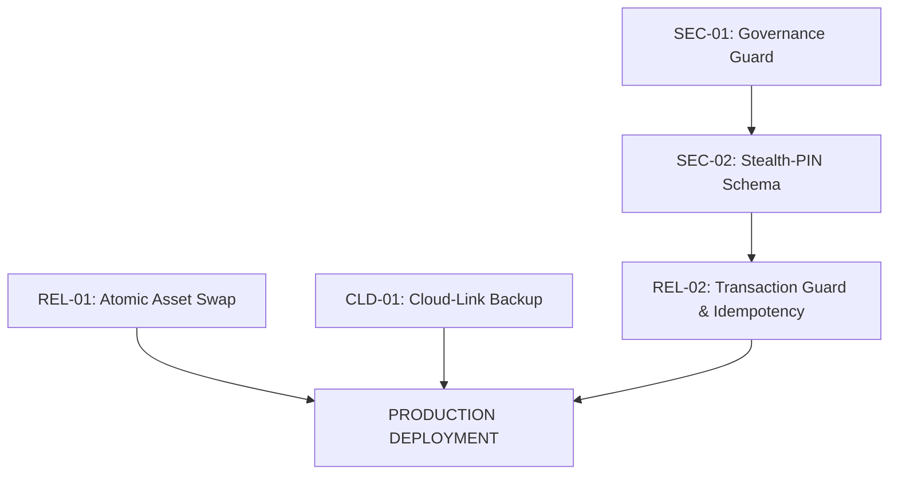

# SMRITI Release Dependency Graph

This document visualizes the hard dependencies and blocking paths for the One-Day Patch Release.

### Critical Path Analysis
- **The Security Path (SEC-01 -> SEC-02)**: Must be completed first as it establishes the trust model for the POS.
- **The Schema Lock (SEC-02)**: This is the only task that modifies the database schema (`User` DocType). It acts as a gate for `REL-02`.
- **The Infrastructure Path (REL-01, CLD-01)**: These are independent of business logic and can be executed in parallel with the Security path.

---

# SMRITI Release Execution Order

| Step | Task ID | Execution Mode | Dependency | Note |
|---|---|---|---|---|
| 1 | **SEC-01** | Sequential | None | Fixes highest risk (P0) |
| 2 | **REL-01** | Parallel | None | Stabilizes UI for other tests |
| 3 | **CLD-01** | Parallel | None | Infrastructure only |
| 4 | **SEC-02** | Sequential | SEC-01 | **DATABASE MIGRATION REQUIRED** |
| 5 | **REL-02** | Sequential | SEC-02 | Finalizes billing integrity |

---

# SMRITI Release Test Matrix

| Task ID | Risk (1-10) | Primary Test Case | Edge Case | Deployment Gate |
|---|---|---|---|---|
| **SEC-01** | 4 | Store Manager cannot reset System Manager password. | Manager *can* still reset Cashier password. | Unit Test Passed |
| **SEC-02** | 6 | Manager can override with 4-digit PIN. | Fallback to password if PIN is null. | Schema Check |
| **REL-01** | 3 | UI remains functional during `sync_assets`. | Handle `rsync` binary missing error. | 404 Monitoring |
| **REL-02** | 8 | Double-click on "Pay" results in only 1 Invoice. | Simulate server kill during `submit_bill`. | Chaos Test |
| **CLD-01** | 5 | Backup file appears in S3 Bucket. | Handle S3 credentials failure gracefully. | Cloud Log Check |

---

# SMRITI Release Rollback Matrix

| Task ID | Rollback Command | DB Cleanup | Complexity |
|---|---|---|---|
| **SEC-01** | `git checkout security_api.py` | None | Low |
| **SEC-02** | `git checkout setup.py billing_api.py shift_api.py` | `bench migrate` (Custom Field remains) | Medium |
| **REL-01** | `git checkout sync_assets.py` | None | Low |
| **REL-02** | `git checkout billing_api.py` | Manual check for partial Invoices | High |
| **CLD-01** | `git checkout backup_api.py` | Remove settings from Company doc | Low |

---

# RELEASE GO / NO-GO CRITERIA

1. **Security Gate**: SEC-01 and SEC-02 must be 100% verified. No launch if privilege escalation remains.
2. **Integrity Gate**: REL-02 must pass the "Chaos Test" (kill during submission).
3. **Operational Gate**: REL-01 must prove zero 404 errors during asset syncing.
4. **Recovery Gate**: CLD-01 must confirm successful off-site upload.

**If any P0 (Security) gate fails, the entire release is aborted.**
