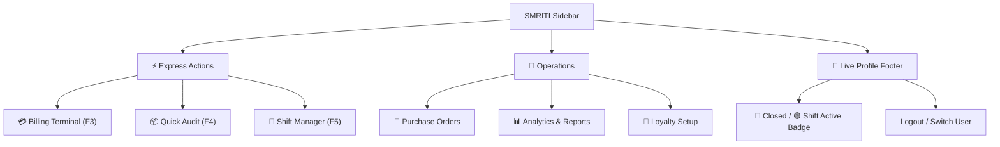

# SMRITI Retail OS — Sidebar & Workspace Enhancement Proposal

This document outlines structural and aesthetic proposals to transform the blank **SMRITI Retail OS** workspace and sidebar into a state-of-the-art, high-conversion Retail Command Center. 

We address both:
1. **The Sidebar (Left Navigation)**: Keeping it clean, distraction-free, and keyboard-friendly for Cashiers and Store Managers.
2. **The Workspace (Right Dashboard)**: Re-engineering the blank screen into a visually stunning, real-time operational dashboard with live stats, alert feeds, and quick actions.

---

## 🛠️ The "Blank Screen" Diagnostic & Quick Fix
The workspace shows up blank in the Desk because it is marked as a standard workspace (`is_standard = 1` in `setup.py`), but Frappe does not find a corresponding physical `.json` configuration file under the app's `workspace/` directory.

### The Immediate Fix:
We will adjust the Workspace definition to be **database-driven** (`is_standard = 0`), which enables Frappe to load the EditorJS layout Blocks and Links dynamically from the database.

```diff
- ws.is_standard = 1
+ ws.is_standard = 0
```
This single line change, combined with a `clear-cache`, forces Frappe to instantly render all custom cards, links, and headers in the database, resolving the blank layout immediately.

---

## 🧭 1. Left Sidebar Navigation: What to Add

To deliver a premium, whitelabel experience, the sidebar must keep cashiers inside the SMRITI ecosystem without exposure to ERPNext's complex back-office menus. 

We propose adding a custom **"SMRITI Quick Launchpad"** at the top of the left sidebar:



### Key Elements to Add to the Left Sidebar:

| Icon | Navigation Item | Target Role | Key Highlight / Feature |
| :--- | :--- | :--- | :--- |
| **💳** | **Express Billing (F3)** | Cashier / Manager | Glow-animated high-contrast button. Launches the POS Billing Terminal instantly. |
| **📦** | **Quick Stock Audit (F4)** | Cashier / Manager | Opens the barcode scanner stock check. Shows immediate warehouse counts on scan. |
| **🌅** | **Shift Status (F5)** | Cashier / Manager | Dynamic indicator dot: **🟢 Green** when shift is active, **🔴 Red** when shift is closed. |
| **🏷️** | **Bulk Barcode Printing**| Store Manager | Select a Purchase Receipt or item list and print stickers in seconds. |
| **👥** | **Customer Database** | Cashier / Manager | Quick view of customer search, onboarding, and history lookup. |
| **📄** | **Sales Invoice Ledger** | Store Manager | View, filter, and audit past store bills. |
| **📊** | **Reports & Analytics** | Store Manager | High-fidelity visualization of sales, cash drawers, and tax (GST) filings. |

---

## 🖥️ 2. Main Workspace Dashboard: The Ultimate Design

A premium workspace should immediately hook the manager or cashier upon logging in. We propose a beautifully structured, glassmorphic layout divided into three clear operational sections.

### Visual Layout Mockup:

```
+---------------------------------------------------------------------------------------------------+
|  🏪 SMRITI Retail Operations Control Center                                      [ 🟢 Shift Active ]|
+---------------------------------------------------------------------------------------------------+
|                                                                                                   |
|  [ Live Cash Drawer ]           [ Average Order Value ]        [ Loyalty Registrations ]          |
|  ₹ 14,820.00                    ₹ 682.50                       18 / 30 Members                    |
|  🟢 Active Cashier: jawahar     📈 +4.2% vs yesterday          🏆 60% of today's target           |
|                                                                                                   |
|  +--------------------------------------------+   +--------------------------------------------+  |
|  | ⚡ Quick Action Launcher                   |   | 🔔 Store Operations Alert Feed             |  |
|  |                                            |   |                                            |  |
|  |  [ 🖥️ POS Terminal ]   [ 🌅 Shift Manager ]|   |  ⚠️ Low Stock: "Amul Butter 500g" (2 left)  |  |
|  |  F3 Key               F5 Key               |   |  🚨 Drawer Cash Limit Exceeded! (₹25k Max) |  |
|  |                                            |   |  💡 Tip: 12 Held Bills waiting in checkout|  |
|  |  [ 📦 Inventory ]      [ 🏷️ Barcode Print ]|   |                                            |  |
|  |  Stock Audit          Tag Printer          |   +--------------------------------------------+  |
|  +--------------------------------------------+                                                   |
|                                                                                                   |
|  +---------------------------------------------------------------------------------------------+  |
|  | 📊 Hourly Store Sales Velocity (Trend Chart)                                                |  |
|  |                                                                                             |  |
|  |   ₹20k |               _/\_                                                                 |  |
|  |   ₹10k |           _/-'    `-\_                                                             |  |
|  |    ₹0k +----------/------------\---------+                                                  |  |
|  |        9 AM      12 PM         4 PM      8 PM                                                   |  |
|  +---------------------------------------------------------------------------------------------+  |
|                                                                                                   |
+---------------------------------------------------------------------------------------------------+
```

### Detailed Widget Breakdown:

### A. Glassmorphic KPI Cards (Top Row)
*   **Live Cash Drawer (Drawer Safe-Check)**:
    *   *What it displays*: Current cash balance inside the drawer.
    *   *Special Logic*: If the balance exceeds **₹25,000**, the card highlights in **amber warning glow** with a caption: *"Safe drop recommended: Cash limit exceeded."* This keeps the storefront secure.
*   **Average Order Value (AOV)**:
    *   *What it displays*: The average bill size today.
    *   *Special Logic*: Compares live data with yesterday's performance to show positive/negative trends with a clean up/down arrow metric.
*   **Loyalty Engagement Progress Bar**:
    *   *What it displays*: Percentage of walk-in customers registered to the loyalty program today.
    *   *Goal*: Motivate cashiers to request phone numbers during checkout (e.g. "Target: 30 new sign-ups, current: 18").

### B. The Quick Action Launcher (Left Center Panel)
Large interactive tiles with elegant hover zoom micro-animations:
1.  **POS Terminal (F3)**: Vibrant emerald green accent, direct link to the fast billing terminal.
2.  **Shift Manager (F5)**: Blue accent, displays cashier session times, opening capital, and closing counts.
3.  **Inventory Audit (F4)**: Indigo accent, optimized for quick stock adjustments on mobile/tablets.
4.  **Barcode Printing**: Purple accent, supports fast label printing on thermal printer rollers.

### C. Live Operations Alert Feed (Right Center Panel)
A reactive list showing high-priority alerts generated by background checkers:
*   **⚠️ Low Stock Warnings**: Instantly flags barcoded items that have dropped below reorder level (e.g. *“Amul Butter 500g has only 2 units remaining”*) with a one-click **"Generate PO"** button next to it.
*   **⚠️ Held Bills Reminder**: Warns the team of any bills held/suspended by cashiers, allowing quick resumption or cleanup.
*   **⚠️ Tax Compliance Warning**: Alerts if a newly added product lacks a HSN code or GST mapping, preventing billing blockages under Indian Tax laws.

### D. Visual Trend Charts (Bottom Row)
*   **Hourly Store Sales Velocity**:
    *   A clean line/bar chart displaying sales volume every hour.
    *   *Business Value*: Allows the store owner or manager to immediately visualize peak footfall hours (e.g. 6 PM - 9 PM) to optimize staff scheduling and cashier terminal allocation.
*   **Top 5 Fast-Moving Items**:
    *   A mini donut chart reflecting which products are generating the highest volume today.

---

## 🚀 Recommended Implementation Checklist

If you approve this vision, we can execute it systematically through the following phases:

- [ ] **Fix Workspace Loading**: Modify `setup.py` to change `is_standard = 0` and reload. Verify the standard `SMRITI Retail OS` dashboard page renders correctly.
- [ ] **Inject CSS Themes**: Apply a sleek, clean, modern glassmorphic look to the desk workspace dashboard.
- [ ] **Establish Live KPI Queries**: Hook up backend query scripts that calculate live sales, cash balances, and average bill sizes to feed into the workspace cards.
- [ ] **Build the Hourly Sales Trend Chart**: Integrate a standard Frappe Dashboard Chart showing hourly sales.
- [ ] **Construct the Alert Feed**: Write a light API endpoint to check for low stock, GST issues, and held bills, displaying them dynamically.


## Revision History

| Version | Date | Author | Summary of Changes |
| --- | --- | --- | --- |
| 1.0.0 | 2026-06-25 | Jawahar R. Mallah | Reorganized & standardized |


---

## Author Profile

- **Author**: Jawahar R. Mallah
- **Designation**: Founder & Chief Architect
- **Organization**: AITDL – AI Technology & Development Lab
- **Professional Experience**: 20+ Years of Experience in Software Development, Retail Technology, Distribution Systems, POS Solutions, ERP Implementations, Business Process Automation, and Enterprise Application Design.

> "Always decision-ready."  
> — Jawahar R. Mallah  
> Founder & Chief Architect, AITDL