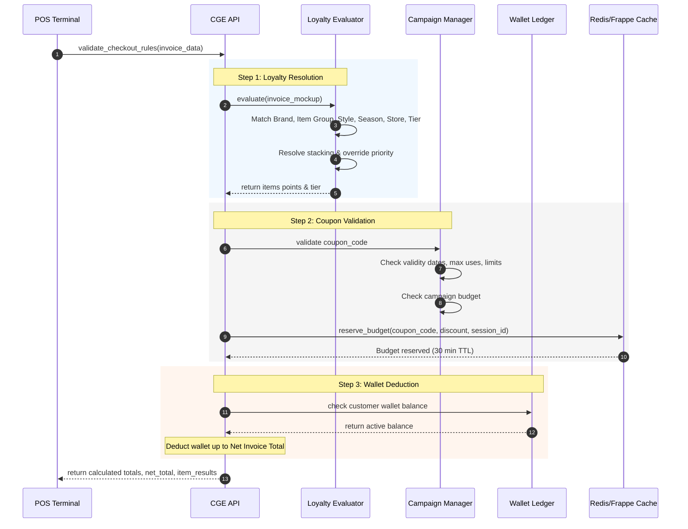
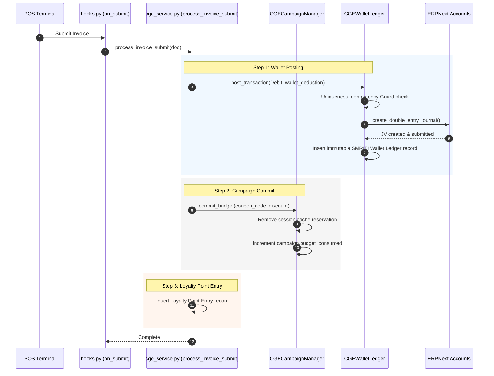
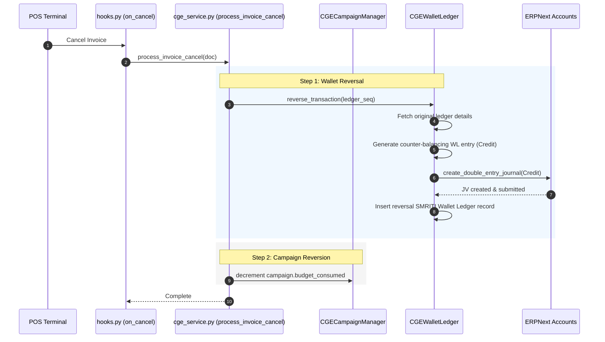
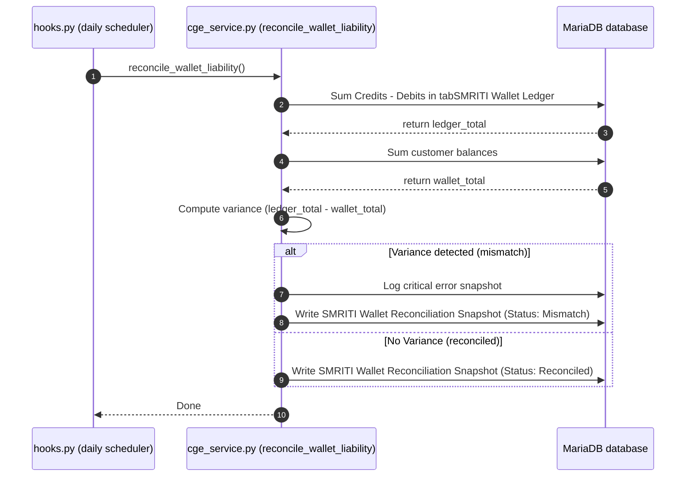

# SMRITI Customer Growth Engine (CGE) — Sequence Diagram Specification

This document details the transaction flow and execution sequences for POS checkout calculations, invoice submissions, cancellations, and nightly reconciliation jobs.

---

## 1. POS Checkout Rules Validation Sequence

When a cashier scans items and applies a coupon/wallet balance, the POS terminal invokes [validate_checkout_rules](../../apps/smriti_retail_os/smriti_retail_os/cge/api/cge_api.py#L20).

---

## 2. Invoice Submit & Cancel Event Hook Sequence

When the invoice is submitted or cancelled, standard event listeners registered in [hooks.py](../../apps/smriti_retail_os/smriti_retail_os/hooks.py) trigger background execution tasks.

### Invoice Submission

### Invoice Cancellation

---

## 3. Daily Scheduled Reconciliation Sequence

Every night, the scheduler triggers [reconcile_wallet_liability](../../apps/smriti_retail_os/smriti_retail_os/cge/service/cge_service.py#L401) to verify database balance consistency.

## Revision History

| Version | Date | Author | Summary of Changes |
| --- | --- | --- | --- |
| 1.0.0 | 2026-06-25 | Jawahar R. Mallah | Reorganized & standardized |

---

## Author Profile

- **Author**: Jawahar R. Mallah
- **Designation**: Founder & Chief Architect
- **Organization**: AITDL – AI Technology & Development Lab
- **Professional Experience**: 20+ Years of Experience in Software Development, Retail Technology, Distribution Systems, POS Solutions, ERP Implementations, Business Process Automation, and Enterprise Application Design.

> "Always decision-ready."  
> — Jawahar R. Mallah  
> Founder & Chief Architect, AITDL