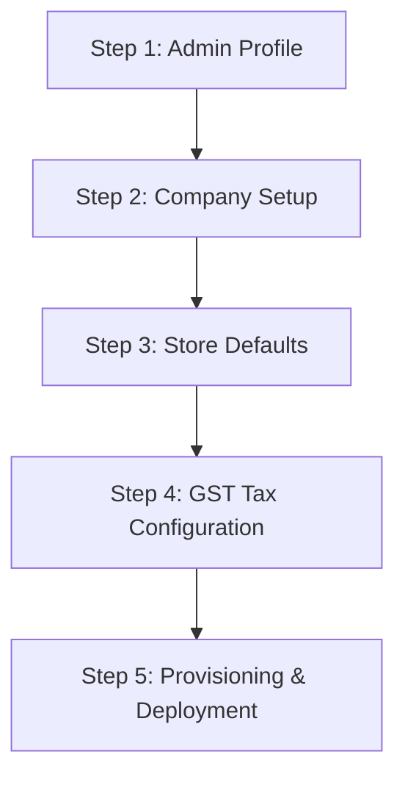

# 🚀 SMRITI Setup & Configuration Wizard

SMRITI Retail OS features a beautiful, standalone **Setup & Configuration Wizard** accessible at `/setup-wizard`. This wizard is designed to guide site administrators through the initial provisioning process for a new retail site, replacing the standard ERPNext setup process with a sleek, whitelabeled, glassmorphic UI.

---

## 🗺️ Stepper Process Overview

The wizard breaks down the provisioning flow into 5 structured steps, validating inputs at each stage to ensure database integrity.



### **1. Admin Profile**
* **Inputs**: Administrator's Full Name, Password (Optional update).
* **Behavior**: Loads the active administrator name from the database. Allows updating the password securely.

### **2. Company Setup**
* **Inputs**: Company Name, Abbreviation, Store Type, State (pre-populated with 36 Indian States/UTs and their GST codes), and optional GSTIN.
* **Validation**: Validates GSTIN format and state match where applicable.

### **3. Store Defaults**
* **Inputs**: Default Warehouse Name (e.g. `Main Store - SDS`), Default Customer Name (e.g. `Walk-in Customer`), and POS Profile Name.
* **Behavior**: Sets up the naming and reference points for POS cash register transactions.

### **4. GST Tax Configuration**
* **Inputs**: GST Tax Template rate selectors (0%, 5%, 12%, 18%, 28%) and a Footwear Attribute Seeding toggle.
* **Behavior**: Pre-selects which tax templates to generate and whether to seed size-specific item attributes.

### **5. Provisioning & Deployment**
* **Console**: An interactive logging window displaying live deployment status updates direct from the backend.
* **Result**: Animates a progress bar and opens a success gate to redirect the admin to `/login` or `/configure` upon completion.

---

## 🛠️ Technical Architecture

The Setup Wizard is built using standard Frappe web pages with a highly responsive, modern tailwind-inspired CSS layout.

### 1. Route Registration
The route rule is registered in the app's `hooks.py`:
```python
website_route_rules = [
    {"from_route": "/setup-wizard", "to_route": "setup_wizard"},
]
```

### 2. Page Controller ([setup_wizard.py](../../apps/smriti_retail_os/smriti_retail_os/www/setup_wizard.py))
Verifies user permissions (only `Administrator` or `System Manager` is allowed to run the setup), injects `csrf_token`, and handles redirection:
```python
def get_context(context):
    if frappe.session.user == "Guest":
        frappe.local.flags.redirect_to = "/login"
        raise frappe.Redirect
    
    # Restrict to System Manager / Administrator
    roles = frappe.get_roles(frappe.session.user)
    if "System Manager" not in roles and frappe.session.user != "Administrator":
        frappe.throw(_("Not permitted to access setup wizard"), frappe.PermissionError)
        
    context.no_cache = 1
    context.title = "SMRITI Setup Wizard"
    context.csrf_token = frappe.sessions.get_csrf_token()
```

### 3. Backend Execution Engine ([setup_wizard_api.py](../../apps/smriti_retail_os/smriti_retail_os/setup_wizard_api.py))
Whitelisted remote functions responsible for performing validation, checking existences, and committing records to the DB:
* `get_setup_wizard_initial_data()`: Seeds default choices and loads lists of states.
* `run_setup_wizard(args)`: The transactional deploy kernel. It performs the following sequence:
  1. Updates Administrator password and full name.
  2. Generates the legal `Company` and inserts default Chart of Accounts.
  3. Pre-populates Mode of Payment accounts (Cash, Bank, UPI, Card).
  4. Generates leaf Customer Group and seeds Walk-in Customer.
  5. Severs default Warehouses and links them.
  6. Creates individual CGST/SGST/IGST tax accounts and sets up Sales Taxes and Charges templates.
  7. Inserts the main `POS Profile` loaded with default warehouse and payment defaults.

---

## 💻 Manual Verification & Diagnostics

To verify the wizard status or manually invoke setup API tasks:

### Verify Setup Access:
Load the webpage at `/setup-wizard`. If you are logged in as a normal user or Guest, you will be redirected to the login gate.

### Check Backend Logs:
Inspect logs inside the docker container during execution to monitor progress:
```bash
docker logs -f smriti_retail_os-backend-1
```

## Revision History

| Version | Date | Author | Summary of Changes |
| --- | --- | --- | --- |
| 1.0.0 | 2026-06-25 | Jawahar R. Mallah | Reorganized & standardized |


---

## Author Profile

- **Author**: Jawahar R. Mallah
- **Designation**: Founder & Chief Architect
- **Organization**: AITDL – AI Technology & Development Lab
- **Professional Experience**: 20+ Years of Experience in Software Development, Retail Technology, Distribution Systems, POS Solutions, ERP Implementations, Business Process Automation, and Enterprise Application Design.

> "Always decision-ready."  
> — Jawahar R. Mallah  
> Founder & Chief Architect, AITDL