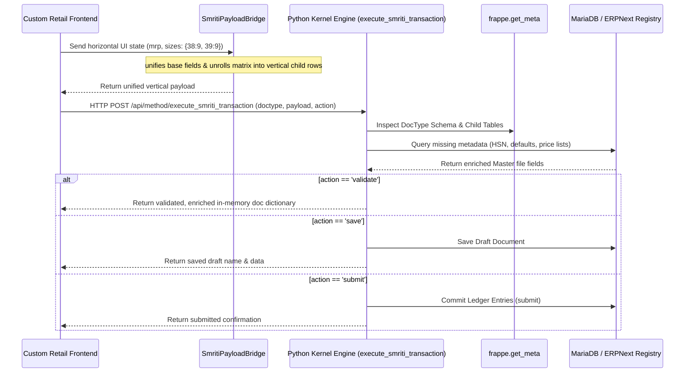

# Universal UI-to-Backend Mapping Layer

This document outlines the architectural specification and source implementation for the universal, metadata-driven mapping layer bridging SMRITI's high-performance retail frontends and the ERPNext/Frappe backends.

---

## 1. Architectural Philosophy

### A. Stateless & Law-Driven
Rather than writing bespoke CRUD controllers for every transaction type (Sales Invoice, Stock Entry, Purchase Order), SMRITI leverages a single stateless mapping kernel. It maps layout states to DocTypes by reflecting on Frappe's rich metadata dictionary (`frappe.get_meta`).

### B. Matrix Flattening
Retail interfaces display item variant grids horizontally (e.g., shoe size columns `38, 39, 40` as inline inputs). Relational backends require vertical storage where each intersection is a child row. The unifier flattens these multi-dimensional states dynamically before transmitting them to the database.

### C. Metaprogramming Over Hardcoding
Field matching, mandatory checks, and link validations are resolved at runtime using the target DocType schema, making the bridge resilient to custom schema extensions without modifying python controllers.

---

## 2. Frontend Payload Unifier (TypeScript)

The `SmritiPayloadBridge` class flattens matrix inputs recursively and structures nested state into standard Frappe child tables.

```typescript
export interface MatrixUnrollConfig {
  childTableField: string;     // e.g. "items"
  matrixField: string;         // e.g. "sizes" mapping size labels -> qty
  rowKeyField: string;         // e.g. "item_code"
  unrolledField: string;       // e.g. "qty"
  attributeKeyField: string;   // e.g. "size"
  keyGenerator: (row: any, attributeKey: string) => string; // e.g. (row, size) => `${row.article}-${row.color}-${size}`
}

export class SmritiPayloadBridge {
  /**
   * Transforms a UI state object into a clean payload structure matching Frappe DocType specifications.
   * 
   * @param uiState Clean object representing form fields and matrix items.
   * @param matrixConfig Unrolling configurations for child tables that contain matrix items.
   */
  public static unifyPayload(
    uiState: Record<string, any>,
    matrixConfig?: MatrixUnrollConfig
  ): Record<string, any> {
    const unified: Record<string, any> = {};

    // 1. Process base fields (excluding child tables/matrices)
    for (const [key, value] of Object.entries(uiState)) {
      if (typeof value !== 'object' || value === null || Array.isArray(value)) {
        unified[key] = value;
      }
    }

    // 2. Unroll matrices if configuration is provided
    if (matrixConfig) {
      const uiRows = uiState[matrixConfig.childTableField] || [];
      const childRows: Record<string, any>[] = [];

      uiRows.forEach((row: any) => {
        const matrixData = row[matrixConfig.matrixField] || {};
        
        // Loop over each active value in the horizontal matrix (e.g., size '38' with quantity > 0)
        for (const [attrValue, qtyVal] of Object.entries(matrixData)) {
          const qty = parseFloat(String(qtyVal)) || 0;
          if (qty <= 0) continue;

          // Clone row and remove horizontal layout fields
          const childRow = { ...row };
          delete childRow[matrixConfig.matrixField];

          // Set vertical attributes
          childRow[matrixConfig.rowKeyField] = matrixConfig.keyGenerator(row, attrValue);
          childRow[matrixConfig.unrolledField] = qty;
          childRow[matrixConfig.attributeKeyField] = attrValue;

          childRows.push(childRow);
        }
      });

      unified[matrixConfig.childTableField] = childRows;
    }

    return unified;
  }
}
```

---

## 3. Stateless Backend Kernel Engine (Python)

The whitelisted `@frappe.whitelist()` endpoint `execute_smriti_transaction` performs dynamic meta-inspection, stateless master record query enrichments, and atomic actions (`validate`, `save`, `submit`).

```python
# -*- coding: utf-8 -*-
import frappe
import json
from frappe import _
from frappe.utils import flt
from smriti_retail_os.company_api import get_active_company, get_company_settings

@frappe.whitelist()
def execute_smriti_transaction(doctype, payload, action="validate"):
    """
    Universal metadata-driven transaction engine for SMRITI Retail OS.
    
    Args:
        doctype (str): Target Frappe/ERPNext DocType name (e.g., "Sales Invoice").
        payload (str|dict): Enriched JSON payload matching DocType schema.
        action (str): Action to execute ('validate', 'save', 'submit').
        
    Returns:
        dict: Standard API response with document state or validation errors.
    """
    # 1. Enforce access control and API permissions
    permission_type = "write" if action in ("save", "submit") else "read"
    frappe.has_permission(doctype, ptype=permission_type, throw=True)
    
    if isinstance(payload, str):
        doc_data = frappe.parse_json(payload)
    else:
        doc_data = payload

    # Ensure company context exists
    if not doc_data.get("company"):
        doc_data["company"] = get_active_company()

    # 2. Reflective Meta-Inspection
    meta = frappe.get_meta(doctype)
    
    # Identify child tables on target doctype
    child_table_fields = {df.fieldname: df.options for df in meta.get_table_fields()}

    # 3. Stateless Item & Link Enrichment
    for fieldname, child_doctype in child_table_fields.items():
        rows = doc_data.get(fieldname) or []
        if not rows:
            continue
            
        for row in rows:
            # Map child metadata automatically using barcode or item codes
            item_code = row.get("item_code")
            barcode = row.get("barcode")
            
            # Resolve item_code from barcode
            if not item_code and barcode:
                item_code = frappe.db.get_value("Item Barcode", {"barcode": barcode}, "parent")
                row["item_code"] = item_code

            # Pull master file values to enrich state
            if item_code and frappe.db.exists("Item", item_code):
                item_doc = frappe.get_doc("Item", item_code)
                
                # Auto-enrich missing relational values
                if not row.get("uom"):
                    row["uom"] = item_doc.stock_uom or "Nos"
                if not row.get("item_name"):
                    row["item_name"] = item_doc.item_name
                if not row.get("description"):
                    row["description"] = item_doc.description
                if not row.get("warehouse"):
                    # Resolve default warehouse from company settings
                    settings = get_company_settings(doc_data["company"])
                    row["warehouse"] = settings.get("default_warehouse") or item_doc.default_warehouse
                    
                # Tax mapping enrichment
                if not row.get("gst_hsn_code") and item_doc.gst_hsn_code:
                    row["gst_hsn_code"] = item_doc.gst_hsn_code

    # 4. Atomic Execution Pipeline
    if action == "validate":
        # Returns enriched state + calculations without writing to database
        doc = frappe.new_doc(doctype)
        doc.update(doc_data)
        doc.validate()
        
        # Enforce client-side calculations trigger (taxes, total margins)
        if hasattr(doc, "calculate_taxes_and_totals"):
            doc.calculate_taxes_and_totals()
            
        return {
            "success": True,
            "document": doc.as_dict()
        }
        
    elif action == "save":
        # Creates or updates a draft document
        doc_name = doc_data.get("name")
        if doc_name and frappe.db.exists(doctype, doc_name):
            doc = frappe.get_doc(doctype, doc_name)
            doc.update(doc_data)
            doc.save(ignore_permissions=True)
        else:
            doc = frappe.new_doc(doctype)
            doc.update(doc_data)
            doc.insert(ignore_permissions=True)
            
        frappe.db.commit()
        return {
            "success": True,
            "name": doc.name,
            "document": doc.as_dict()
        }
        
    elif action == "submit":
        # Commits the document to system ledger
        doc_name = doc_data.get("name")
        if doc_name and frappe.db.exists(doctype, doc_name):
            doc = frappe.get_doc(doctype, doc_name)
            doc.update(doc_data)
        else:
            doc = frappe.new_doc(doctype)
            doc.update(doc_data)
            doc.insert(ignore_permissions=True)
            
        doc.submit()
        frappe.db.commit()
        return {
            "success": True,
            "name": doc.name,
            "submitted": True
        }
        
    else:
        frappe.throw(_("Invalid transaction action: {0}").format(action))
```

---

## 4. Pipeline Execution Flow



## Revision History

| Version | Date | Author | Summary of Changes |
| --- | --- | --- | --- |
| 1.0.0 | 2026-06-25 | Jawahar R. Mallah | Reorganized & standardized |


---

## Author Profile

- **Author**: Jawahar R. Mallah
- **Designation**: Founder & Chief Architect
- **Organization**: AITDL – AI Technology & Development Lab
- **Professional Experience**: 20+ Years of Experience in Software Development, Retail Technology, Distribution Systems, POS Solutions, ERP Implementations, Business Process Automation, and Enterprise Application Design.

> "Always decision-ready."  
> — Jawahar R. Mallah  
> Founder & Chief Architect, AITDL