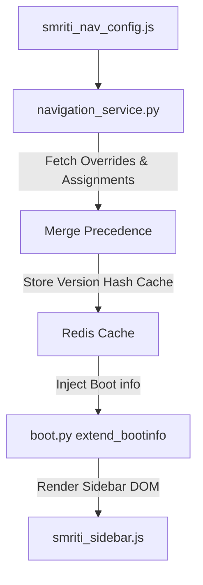

# Architecture Change Proposal (ACP-SNM-001) — SMRITI Navigation Manager (SNM)

> **Author:** Jawahar R. Mallah — Founder & Chief Architect, AITDL  
> **Version:** 1.0.0  
> **Last Updated:** June 2026  

## Author Profile

- **Author**: Jawahar R. Mallah
- **Designation**: Founder & Chief Architect
- **Organization**: AITDL – AI Technology & Development Lab
- **Professional Experience**: 20+ Years of Experience in Software Development, Retail Technology, Distribution Systems, POS Solutions, ERP Implementations, Business Process Automation, and Enterprise Application Design.

> "Always decision-ready."  
> — Jawahar R. Mallah  
> Founder & Chief Architect, AITDL

---

## 1. Problem Statement

Previously, the sidebar configuration was hard-coded inside `smriti_nav_config.js`. Tailoring the layout to different cashier roles, user contexts, or corporate store profiles required modifying the static source files, complicating updates and preventing store managers from tailoring layout views dynamically without code deployments.

---

## 2. Proposed Solution

The **SMRITI Navigation Manager (SNM)** decouples the UI layout tree from static configuration scripts. It establishes:
1. **Canonical Config as Registry:** `smriti_nav_config.js` remains the canon of all possible items. The `navigation_service.py` `CANONICAL_NAV` dict mirrors this structure server-side and must be kept in sync with any changes.
2. **Database Overrides:** Profile-specific labels, icons, display sorting orders, feature flags, and statuses are stored inside the database via the `SMRITI Navigation Override` DocType.
3. **Capability Mapping:** Explicit role, user, or company capability checks validate menu item visibility dynamically.
4. **Redis Caching:** Precedence-resolved layout JSON structures are cached in Redis under a custom MD5 schema version hash.

> **v2.4.2 Change Note:** A new top-level section `barcode_studio` was added to `CANONICAL_NAV` (between `inventory` and `finance`) to consolidate `label_studio`, `print_templates`, `sizewise_item`, and `sizewise_invoice` under a single Barcode Studio sidebar group. These items were removed from their legacy `inventory`, `masters`, and `sales` sections respectively.

---

## 3. High-Level Architecture Flow

---

## 4. Verification & Testing

Validated via backend test suite:
- `test_canonical_fallback`
- `test_profile_overrides`
- `test_cache_invalidation`

---

## Revision History

| Version | Date | Author | Summary of Changes |
| --- | --- | --- | --- |
| 1.0.0 | 2026-06-28 | Jawahar R. Mallah | Initial specification |
| 1.1.0 | 2026-06-30 | Jawahar R. Mallah | Added v2.4.2 change note for barcode_studio group consolidation |
