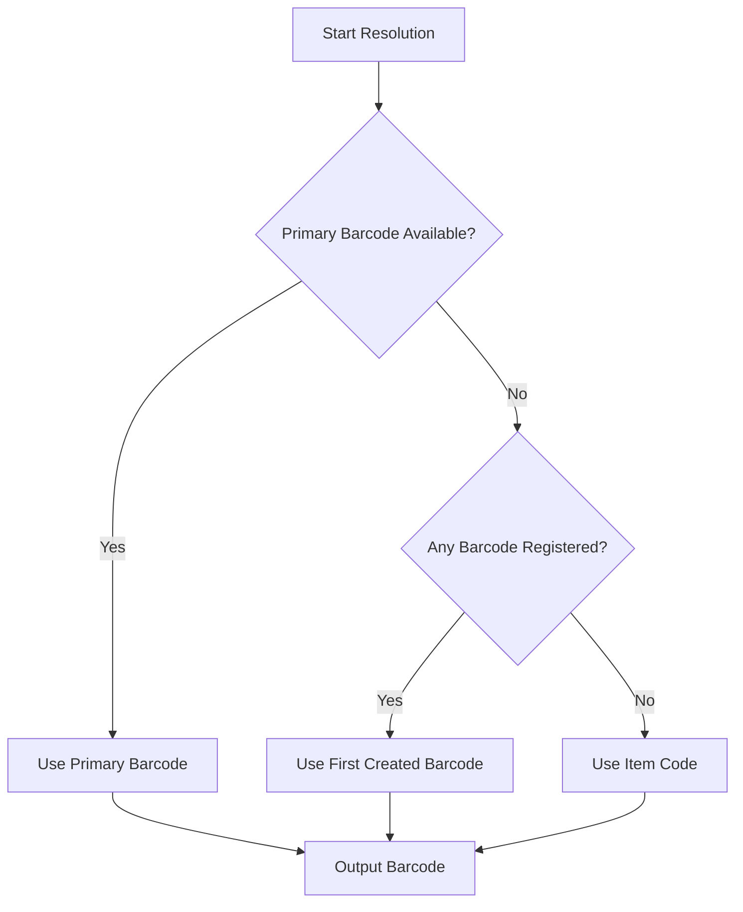

# Barcode Architecture & Validation Hardening (Option B)

SMRITI Retail OS implements **Option B: Primary + Secondary Barcode Support** for item identification, print routing, and system-wide collision prevention.

---

## 1. Data Schema & Core Fields

The `Item Barcode` child DocType in ERPNext has been extended with the following field via `setup.py`:

| Fieldname | Label | Fieldtype | Default | Description |
|---|---|---|---|---|
| `custom_is_primary` | Is Primary | Check | `0` | Identifies the primary barcode. Enforced to be unique per item. |

Every sellable item (size-variant) can have multiple secondary barcodes, but **exactly one primary barcode** must be marked.

---

## 2. Collision & Validation Safeguards

System-wide checks are run on every variant insertion, manual creation, and excel/pivot import:

1. **System-Wide Uniqueness**: No two items can share the same barcode value (whether primary or secondary).
2. **Item Code Collision Guard**: No barcode value can match any existing `Item.item_code` in the system (preventing overlap with manual/sku identifiers).
3. **Single Primary Constraint**: When saving/updating a variant, exactly one primary barcode is enforced. If a new primary is set, pre-existing secondary barcodes are preserved, while any old primary barcode is removed or converted to secondary.
4. **Manual Format Guard**: Manual barcodes are validated using the regular expression `^[a-zA-Z0-9\-_]+$`:
   - **Allowed**: Alphanumeric characters (`A-Z`, `a-z`, `0-9`), hyphens (`-`), and underscores (`_`).
   - **Rejected**: Spaces, tabs, and special symbols (e.g. `@`, `#`, `$`, `%`).
   - **Length Range**: Must be between 3 and 30 characters.

---

## 3. Barcode Auto-Generation (EAN-13)

For automatic barcode generation, SMRITI constructs valid EAN-13 barcodes using the company's prefix:
- The generator checks both `Item Barcode.barcode` and `Item.item_code` to ensure absolute uniqueness before assigning a newly minted EAN-13 check digit barcode.

---

## 4. Fallback Resolution Strategy

When printing tags or lookup keys, the system resolves the barcode using a prioritized fallback chain:

---

## 5. Audit & Missing Barcode Detection

To identify catalog inconsistencies (active sellable items that do not have any registered barcodes), SMRITI exposes a whitelisted endpoint:

`GET /api/method/smriti_retail_os.item_master_api.get_items_missing_barcodes`

- **Criteria**: Returns active items (`disabled = 0`) that do not have any child barcode rows and are not templates (`has_variants = 0`).
- **Role Requirement**: SMRITI Store Manager.

---
## 6. SMRITI Barcode Studio V2.4a Operations (ACP_BARCODE_003)

SMRITI Barcode Studio V2.4a provides a widescreen, 3-panel operations center for high-volume warehouse printing:
1. **Article Range Loader**: Sequentially generates style IDs between two alphabetic/numeric boundaries (e.g., `BBM-0001` to `BBM-0100`) and queries matching items in bulk.
2. **Fashion-Retail Variant Expansion**: Styles automatically expand into size-color variants in the center worksheet grid.
3. **Interactive 9-Column Grid**: Consolidates selected items and enables editing of quantities, label counts, and printing tags.
4. **Price Fallback Logic**: Automatically checks variant-level pricing, Price Lists, and parent templates to prevent printing empty rates.
5. **Box & Carton Mode**: Converts carton packing capacities to label counts automatically.
6. **Reprint Queue**: Caches the history of recent print batches in browser local storage for quick one-click reprints.

---

## 7. Barcode Scan Telemetry Collection Framework (ACP-BARCODE-002A)

To track physical scanning performance and print usability, SMRITI implements a telemetry pipeline:
1. **Immutable Raw Log (`SMRITI Barcode Scan Event`)**: Captures cashier scans with attempt counts, scan success status, template ID, and unique UUIDs for idempotency.
2. **Governance Event Registry**: Seeds and tracks `SCAN-EVT-001` (Success on first try), `SCAN-EVT-002` (Success on retry), and `SCAN-EVT-003` (Failure or manual override).
3. **Scan Reliability Score (SRS)**: Calculates template and store scanning performance:
   $$SRS = \left( \frac{FirstPassSuccesses + 0.5 \times RetrySuccesses}{TotalScans} \right) \times 100$$
4. **90-Day Retention Policy**: Prunes raw event logs older than 90 days daily via the system scheduler job `delete_expired_scan_events`. Snapshots are stored permanently.
5. **Role-based API Access**: Restricts submission to authenticated POS cashiers, managers, and system managers.
