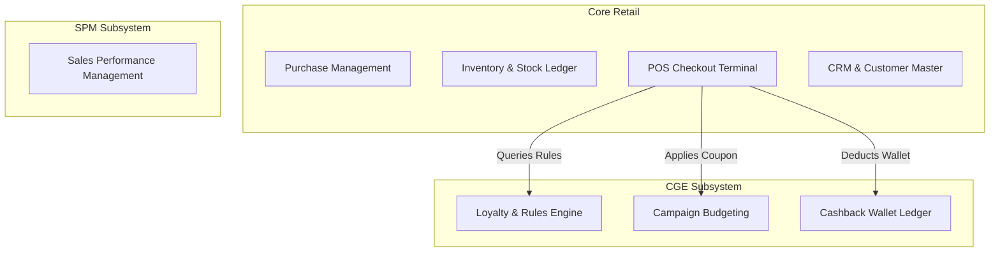
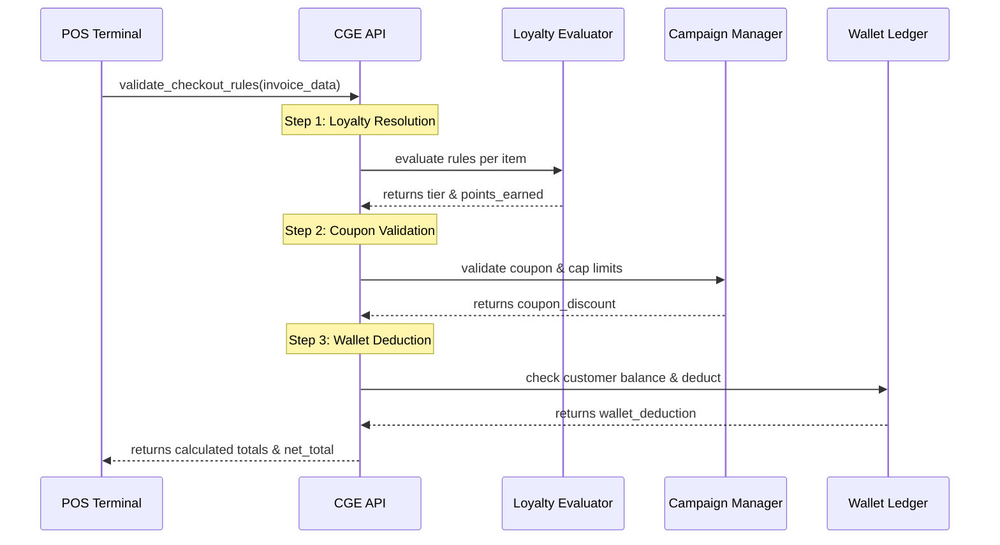
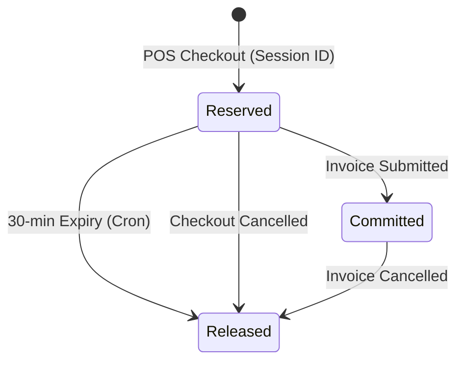

# SMRITI Customer Growth Engine (CGE) — Architecture Specification v1.0

This document defines the production-ready baseline architecture for the SMRITI Customer Growth Engine (CGE) subsystem (v1.0-RC), detailing the component interaction, execution pipeline, data models, and system boundary constraints.

---

## 1. System Identity & Bounded Contexts

Following the **SMRITI Retail OS Constitution**, ERPNext remains the backend transaction and accounting Engine of Record, while SMRITI owns the frontend experience layer, checkout workflows, and intelligence engines.

The business contexts are strictly separated as follows:

*   **Core Retail**: Owns standard operations including stock ledger entries, company accounts, tax rules, and customers.
*   **CGE (Customer Growth Engine)**: Owns promotional campaigns, loyalty rules, coupons, and customer cashback wallets. It does not replace or duplicate standard ledger entries but integrates with them via service APIs.
*   **SPM (Sales Performance Management)**: A separate bounded context dedicated to salesperson tracking, incentives, and commissions, isolated under `smriti_retail_os/spm/`.

---

## 2. POS Checkout Rule Pipeline

The POS Checkout calculation is routed through a single API entry point: [validate_checkout_rules](../../apps/smriti_retail_os/smriti_retail_os/cge/api/cge_api.py#L20). This pipeline processes calculations in a deterministic sequence to evaluate discounts, loyalty points, and cashback deductions.

### Calculation Steps
1.  **Loyalty Resolution**: Evaluates item-level promotions using [CGERuleEvaluator](../../apps/smriti_retail_os/smriti_retail_os/cge/service/cge_service.py#L24) based on active tiers.
2.  **Coupon Validation**: Checks linked `Pricing Rule` scope, validity dates, maximum global/customer/mobile usage, and daily limits.
3.  **Wallet Deduction**: If requested, validates that the user's available cashback balance is sufficient and applies the deduction up to the net invoice total.

---

## 3. The Loyalty & Rules Engine

The loyalty evaluation engine is driven by [CGERuleEvaluator](../../apps/smriti_retail_os/smriti_retail_os/cge/service/cge_service.py#L24). It maps transaction dimensions to active rules.

### Matching Dimensions
Rules are matched against:
*   **Brand**: Matches item's brand.
*   **Item Group**: Matches item's classification.
*   **Style**: Matches custom style code.
*   **Season**: Matches custom season tag.
*   **Store**: Matches transaction warehouse.
*   **Customer Group**: Matches customer classification.
*   **Tier**: Matches customer's active loyalty tier.

### Overrides & Stacking
*   **Exclusion**: Exclusions have top priority. If any rule of type `Exclusion` matches an item, it immediately yields a `0.0` multiplier and stops further matching.
*   **Stacking Multipliers**: If multiple `Multiplier` rules match an item, they are multiplied together (e.g., $1.5 \times 1.2 = 1.8$). If any matching rule has `allow_stack = 0`, only the single rule with the highest priority (and highest value) is applied.
*   **Bonus Points**: Adds flat point values. Non-stacking bonus rules resolve to the maximum single bonus.
*   **Caps**: Point accumulation limits are evaluated by picking the lowest cap value among matching rules.

### Rule Evaluation Tracing
If `enable_rule_trace` is checked in [smriti_cge_settings.json](../../apps/smriti_retail_os/smriti_retail_os/smriti_retail_os/doctype/smriti_cge_settings/smriti_cge_settings.json), matching operations are logged in `SMRITI Rule Evaluation Log` for cashier visibility.

---

## 4. Campaign Budgeting & Reservations

The [CGECampaignManager](../../apps/smriti_retail_os/smriti_retail_os/cge/service/cge_service.py#L215) prevents marketing budget overrun.

*   **Temporary Reservation**: During POS checkout, the estimated discount is added to the campaign's `budget_reserved` and stored in Redis with a 30-minute expiration.
*   **Commitment**: Upon submit (via [hooks.py](../../apps/smriti_retail_os/smriti_retail_os/hooks.py) event listeners), the reservation is deleted, and `budget_consumed` is incremented.
*   **Release & Expiry**: A cron job runs every 30 minutes to clean up expired session allocations and release reserved budgets.

---

## 5. Wallet Cashback Shadow Ledger

The wallet ledger runs as an append-only shadow ledger using the custom DocType [smriti_wallet_ledger.json](../../apps/smriti_retail_os/smriti_retail_os/smriti_retail_os/doctype/smriti_wallet_ledger/smriti_wallet_ledger.json).

### Ledger Integrity Controls
*   **Immutability**: Python controllers block `on_update` and `on_trash` events, preventing any modifications or deletions of historical records.
*   **Reversals**: Correcting transactions is handled by posting counter-entries (Reversals) referencing the original ledger ID.
*   **Double-Entry Journal Alignment**: Every posted transaction triggers an ERPNext `Journal Entry` containing matching credit/debit vouchers to keep physical ledger accounts in sync.

---

## 6. Daily Scheduled Reconciliation

To guarantee ledger integrity, CGE runs a daily reconciliation job:
1.  **Ledger Balance Summary**: Computes the sum of all `Credit` transactions (excluding expired) minus `Debit` transactions across the entire `tabSMRITI Wallet Ledger`.
2.  **Customer Wallet Sum**: Sums up the calculated net balances of individual customer wallets.
3.  **Variance Check**: Calculates $\text{Ledger Total} - \text{Wallet Total}$.
4.  **Reconciliation Log**: Stores the result in [SMRITI Wallet Reconciliation Snapshot](../../apps/smriti_retail_os/smriti_retail_os/smriti_retail_os/doctype/smriti_wallet_reconciliation_snapshot).
5.  **Alerting**: If a variance $\ne 0$ is detected, it raises a critical alert inside the system Error Log.

## Revision History

| Version | Date | Author | Summary of Changes |
| --- | --- | --- | --- |
| 1.0.0 | 2026-06-25 | Jawahar R. Mallah | Reorganized & standardized |

---

## Author Profile

- **Author**: Jawahar R. Mallah
- **Designation**: Founder & Chief Architect
- **Organization**: AITDL – AI Technology & Development Lab
- **Professional Experience**: 20+ Years of Experience in Software Development, Retail Technology, Distribution Systems, POS Solutions, ERP Implementations, Business Process Automation, and Enterprise Application Design.

> "Always decision-ready."  
> — Jawahar R. Mallah  
> Founder & Chief Architect, AITDL