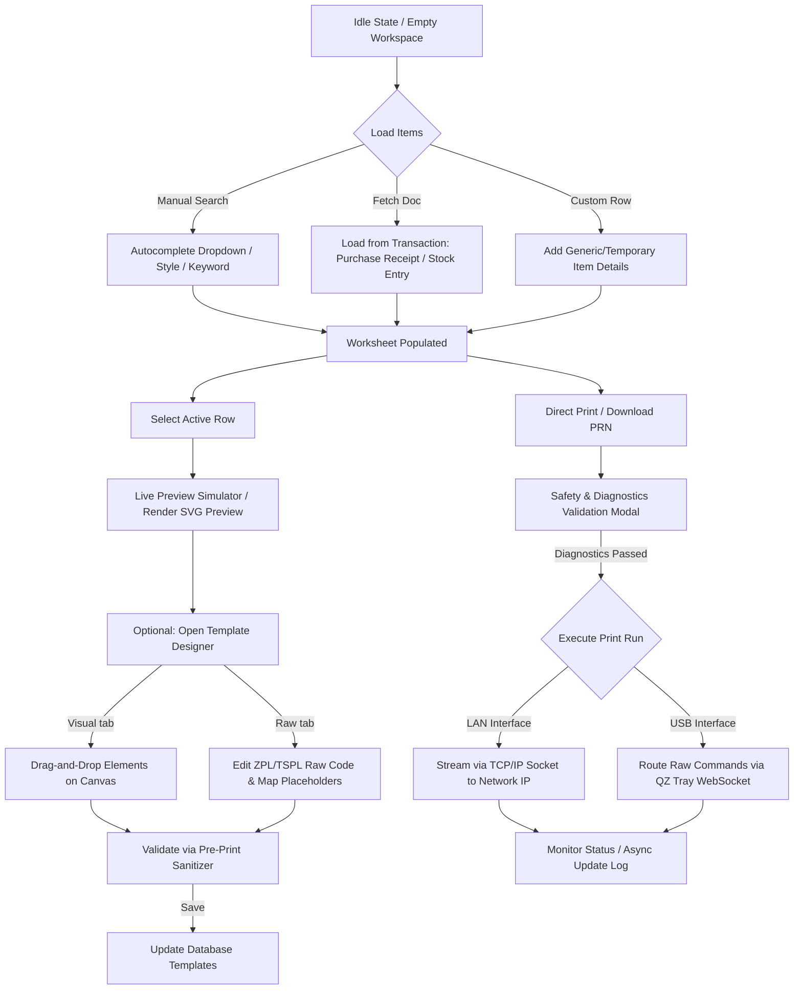

# SMRITI Retail OS — Barcode Module Audit Report (Phase 2C-W4A)

## Executive Summary
* **Module Role:** SMRITI Label Studio V2 (Visual Canvas Designer & Printer)
* **Status:** Legacy UI / Pre-Bridge State
* **Hardware Sensitivity:** High (Thermal label printing, ZPL/TSPL output, local/USB socket interfaces)
* **Risk Classification:** Medium-High (Safe to bridge UI container theme; critical to protect canvas scale math and label rendering dimensions)

---

## 1. Scanner & Printer Library Inventory

A comprehensive search of `barcode.html` was conducted to identify camera, video, ZXing, Html5Qrcode, and Quagga scanner libraries.

* **ZXing / Html5Qrcode / Quagga:** **NOT PRESENT** (0 matches).
* **Native Camera APIs (`navigator.mediaDevices`):** **NOT PRESENT** (0 matches).
* **Keyboard Wedge Capture / Focus Locking:** **NOT PRESENT** (0 matches).
* **QZ-Tray Library (`qz-tray.js?v=2.1.2`):** **PRESENT** (Loaded via jsdelivr CDN). Used to manage local WebSocket connection to QZ Tray desktop client, query local printers list, and route raw thermal printing command streams (USB mode).
* **Socket.io (`/socket.io/socket.io.js`):** **PRESENT**. Used for real-time print status events (`smriti.barcode.print_status`) pushed asynchronously from the server.

### Conclusion:
SMRITI Label Studio is a **designer and thermal printing studio**, not an active scanner page. There are no video feeds, camera overlays, or autofocus capture scripts that can be disrupted by structural CSS modifications.

---

## 2. Page Workflow Mapping

The core workflow of the page follows a visual design-and-print sequence:

1. **Idle State:** Workspace is empty; local QZ-Tray socket connects in the background; defaults fetched from Company Settings.
2. **Variant Load:** Items are populated into the worksheet via manual search, recent transaction lookups (Purchase Receipt/Stock Entry), or temporary row creation.
3. **Live Simulator:** High-fidelity simulation preview (`#sim-label-box`) dynamically renders the active row using SVG coordinate generation at 203/300 DPI.
4. **Visual Layout Designer:** Split designer allows coordinates modification (Drag-and-Drop) on canvas (`#visual-canvas`), mapping placeholder tokens (`{barcode}`, `{mrp}`, `{item_name}`) to ERP fields.
5. **Sanitation & Pre-Print validation:** Code editor validator parses syntax. The safety confirmation modal runs collision and boundary checks before executing prints.
6. **Print Execution:** Sends ZPL/TSPL output over network TCP sockets (LAN) or local device handles (QZ USB).

---

## 3. Legacy Variable Inventory

The custom app styles are completely isolated in the document's header block and inline styles.

* **Embedded Style Blocks:** **2**
  * Block 1 (Main UI Styles - `<head>`): Lines 17–319 (301 lines).
  * Block 2 (Print Window Template - JS Function): Lines 4008–4027 (20 lines) — used to force white page backgrounds during standard browser printing of preview PDFs.
* **`:root` CSS Variables:** **19**
  * Includes standard theme colors: `--bg`, `--bg2`, `--card`, `--card2`, `--border`, `--border2`, `--primary`, `--primary-lt`, `--accent`, `--success`, `--warning`, `--danger`, `--text`, `--text-muted`, `--text-sub`.
  * Layout variables: `--radius`, `--radius-sm`, `--radius-lg`, `--t`.
* **Downstream `var()` References:** **324**
* **Inline `style="..."` Attributes:** **273**
* **Branded Sidebar CSS:** Loaded from `/assets/smriti_retail_os/css/smriti_sidebar_standalone.css` (legacy wrapper).

---

## 4. Hardware Risk Zones

The following logic and layouts are critical to print dimensions and socket streaming, and **MUST NOT** be modified:

| Risk Zone | Affected Functions / Elements | Why it is locked |
| :--- | :--- | :--- |
| **Canvas Scale Ratio** | `#visual-canvas`, `#visual-canvas-scroll-container` | Sized at `1mm = 8px`. Changing layouts, padding, or scaling breaks visual coordinate alignment with ZPL outputs. |
| **DPI Dimension Math** | `toDots(mm)`, `renderSVGPreview()` | Performs conversion `Math.round(mm * dpi / 25.4)`. Crucial for physical 203 DPI and 300 DPI layout calculations. |
| **ZPL/TSPL Compilers** | `compileVisualToPRN()`, `resolveTokens()` | Compiles drag-and-drop vector elements into hardware-compatible raw print codes. |
| **Local USB Handlers** | `qz.websocket`, `qz.print()`, `initQZ()`, `refreshQZPrinters()` | Relies on exact WebSocket callbacks to interface with the local printer hardware. |
| **Diagnostics Engine** | `validateLayoutDiagnostics()`, `checkElementCollision()` | Collision detection checks for label overflows, which prevents physical print failures. |
| **Network socket endpoints** | `test_printer_connection`, `enqueue_print_job` | Integrates with python raw socket API layer to communicate with LAN printer devices. |

---

## 5. Token Bridge Feasibility & Risk Rating

* **Feasibility:** **HIGH**
* **Risk Rating:** **MEDIUM**

### Feasibility Rationale:
Since there is no camera/scanning overlay code, the risk of blocking scanner workflows is zero. The token bridge can be implemented cleanly by loading `smriti_tokens.css`, mapping the 19 legacy `:root` variables to namespaced SMRITI tokens, and boot-strapping the UI Configuration engine in the lifecycle init.

### Risk Controls:
* **Label Color Safeguard:** Printed thermal labels are physically white, and characters are black. The elements `#visual-canvas`, `.sim-label`, and `.visual-elem` use explicit literal color values (`#ffffff` background, `#000000` text) to ensure the simulator does not turn dark when theme changes to `pos-dark` or `hybrid`. These canvas styles **must remain unbridged and fixed**.
* **Dimension Safeguard:** All layout container panels (sidebar, settings forms, buttons, table worksheet, headers) can be safely bridged to resolve `pos-dark`/`light` theme classes without impacting the canvas coordinate system.

## Revision History

| Version | Date | Author | Summary of Changes |
| --- | --- | --- | --- |
| 1.0.0 | 2026-06-25 | Jawahar R. Mallah | Reorganized & standardized |

---

## Author Profile

- **Author**: Jawahar R. Mallah
- **Designation**: Founder & Chief Architect
- **Organization**: AITDL – AI Technology & Development Lab
- **Professional Experience**: 20+ Years of Experience in Software Development, Retail Technology, Distribution Systems, POS Solutions, ERP Implementations, Business Process Automation, and Enterprise Application Design.

> "Always decision-ready."  
> — Jawahar R. Mallah  
> Founder & Chief Architect, AITDL