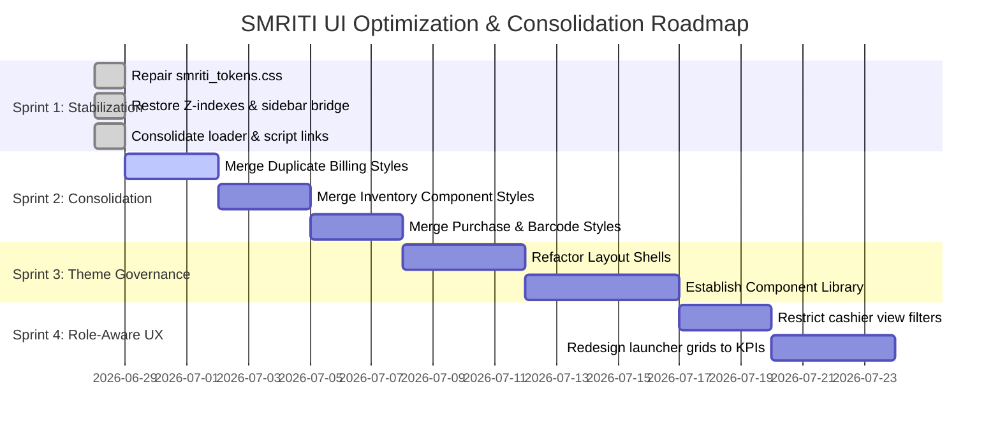

# SMRITI UI Governance Constitution & Architecture Directive

---

## ✍️ Author & Document Metadata

### Author Profile
* **Author**: Jawahar R. Mallah
* **Designation**: Founder & Chief Architect
* **Organization**: AITDL – AI Technology & Development Lab
* **Professional Experience**: 20+ Years of Experience in Software Development, Retail Technology, Distribution Systems, POS Solutions, ERP Implementations, Business Process Automation, and Enterprise Application Design.

### Author Note
> This constitution is established to enforce front-end discipline, eliminate design system fragmentation, and ensure that the presentation layer of SMRITI Retail OS is built with the same architectural rigor, security, and traceability as the underlying backend transaction engines. Every page, component, and style within SMRITI must be decision-ready and self-documenting.
>
> "Always decision-ready."
> 
> — Jawahar R. Mallah
> Founder & Chief Architect, AITDL

### Document Metadata
* **Documentation Version**: v1.0.0
* **Release Date**: 2026-06-28
* **Intended Audience**: Front-end Engineers, Core Contributors, CI/CD DevOps Engineers, UI/UX Designers.
* **Learning Objectives**: Understand the UI design token architecture, the 10 core governance rules (UG-01 to UG-10), the automated CI validation checklist, and the stabilization/consolidation roadmap.
* **Support**: SMRITI Core Architecture Team / AITDL Lab Support.

### Revision History
| Version | Date | Description | Author |
| :--- | :--- | :--- | :--- |
| v1.0.0 | 2026-06-28 | Initial release of SMRITI UI Governance Constitution. | Jawahar R. Mallah |

---

## 🏛️ Core Principles

ERPNext remains the transactional System of Record, while SMRITI owns the user experience and intelligence layer. To prevent styling drift and component duplication, SMRITI enforces a strict **Single Source of Truth** design token model. 

```
  SMRITI Theme Engine
          ↓
  smriti_tokens.css (Level 7 Default Defaults)
          ↓
  smriti_ui_resolver.js (Runtime Overrides)
          ↓
  Every Page / Component CSS
```

---

## 📜 UI Governance Rules (UG-01 — UG-10)

### UG-01: Single Token Source
All style modules, layout definitions, and page-specific styles MUST resolve spacing, colors, sizing, and shadows from a single centralized tokens file: `smriti_tokens.css`. Direct layout or color hardcoding is strictly forbidden.

### UG-02: No Duplicate Component CSS
Feature interfaces (e.g. Billing, Barcode, Inventory, Purchase, Reports) must share the same canonical stylesheet. No page-specific stylesheet duplicates are allowed. Desk Page styles and standalone Web Page styles must import the same unified component libraries.

### UG-03: No Hardcoded Colors
All color definitions must consume approved `--smriti-color-*` design variables. Raw hex codes (`#fff`), basic color names (`red`), or absolute `rgb`/`rgba` functions are prohibited in local page files.

### UG-04: No Undefined CSS Variables
Any CSS variable referenced via `var()` must actively exist in `smriti_tokens.css`. Referencing an undefined variable results in a failed build.

### UG-05: Every Page Uses Layout Shell
Every SMRITI page template must wrap its content inside the standard `.smriti-shell` structure, incorporating the sidebar container, topbar breadcrumbs, and a main `.smriti-content` viewport layout.

### UG-06: Role-Aware Rendering
Dashboard launchers, quick actions, database metrics, and configuration links must adapt dynamically based on user session roles (e.g. restricting Platform Administration commands from SMRITI Cashier roles).

### UG-07: Responsive CSS Grid Required
Layout grids must be built with standard, fluid CSS Grid and Flexbox layouts (using auto-fill, auto-fit, and fluid container boundaries) to guarantee support across standard tablet, mobile, and wide viewport POS terminals.

### UG-08: Accessibility & Contrast Compliance
All text elements, cards, status badges, and input selectors must maintain a minimum contrast ratio of 4.5:1. Interactive touch targets (buttons, links) must have a minimum size of 44x44 pixels.

### UG-09: Token Namespace Enforcement
All newly introduced custom properties must follow the AITDL-approved namespace structure: `--smriti-{category}-{name}` (e.g., `--smriti-spacing-card`, `--smriti-color-bg-page`). General un-prefixed names are disallowed.

### UG-10: Theme Validation During CI
The build and CI pipeline must parse all HTML and CSS files to enforce these rules. Build processes will fail automatically upon identifying undefined variables, hardcoded colors, or component duplications.

---

## 🛡️ Automated CI Validation Specifications

The following checks will run in the CI/CD pipeline and pre-commit hooks to enforce UI compliance:

### 1. Undefined CSS Variable Check
Matches any `var(--smriti-*)` expression against the index of declared variables inside `smriti_tokens.css`.
- **Fail condition:** Any variable referenced in a `.css` or `.html` file that is not defined in the token registry.

### 2. Hex/Raw Color Linter
Scans all stylesheet files (excluding `smriti_tokens.css`) for raw hex patterns (`#` followed by hex digits), `rgb()`, `rgba()`, `hsl()`, or basic text colors.
- **Fail condition:** Direct color specifications outside of the token registry.

### 3. Selector & File Duplication Linter
Identifies matching class naming patterns across split directories (e.g., `smriti_billing.css` in both `public/` and `page/`).
- **Fail condition:** Multiple files declared for a single component module.

---

## 🗺️ Suggested Remediation Roadmap



### Sprint 1 — Stabilization (Completed)
- **Token Repair:** Restored corrupted comment blocks and double definitions in `smriti_tokens.css`.
- **Z-Index Layering:** Added missing `--smriti-z-index-*` tokens to standardise rendering stacks.
- **Sidebar Integration:** Built layout bridge variables (`--smriti-sidebar-width` and `--smriti-sidebar-collapsed-width`) to resolve expansion/collapse misalignment.

### Sprint 2 — Consolidation (Next)
- Merge duplicate CSS files:
  - Consolidate Web and Desk billing CSS files into a single, unified `billing.css` file.
  - Consolidate inventory, purchase, and barcode files.

### Sprint 3 — Theme Governance
- Enforce the component import structure. No styling files should define local structural parameters without inheriting layout cards from the design tokens.

### Sprint 4 — Role-Aware Dashboard
- Replace static, launcher-heavy page items with high-value operational metrics (Daily Sales velocities, Cash/UPI breakdown, GST alert feeds, recent transactions) populated relative to user roles.

---

## 🚫 UI Architecture Freeze Directive

Effective immediately, a **UI Architecture Freeze** is declared:
1. No new styling stylesheets may be introduced into the repository.
2. Development on new user interface screens is paused until Sprint 2 (Consolidation) tasks are complete.
3. Feature additions must reuse existing layout templates and components without adding custom local styling overrides.

---

## 🏁 Final Acknowledgement

This constitution must be reviewed and accepted by all developers before staging changes to the main codebase.

> "Standardization of the presentation layer is the final gate to software quality."
> 
> — Jawahar R. Mallah
> Founder & Chief Architect, AITDL
