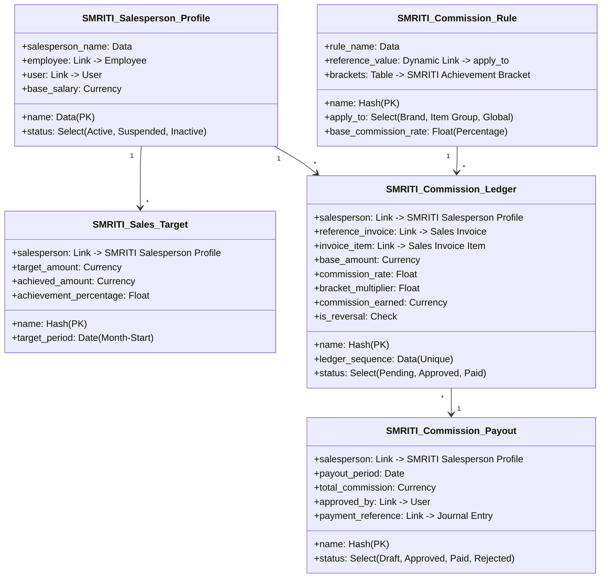

# SMRITI Sales Performance Management (SPM) — Architecture Blueprint v1.0

This document defines the initial architectural blueprint, database schemas, commission calculation rules, and security controls for the SMRITI Sales Performance Management (SPM) v1.0 module.

---

## 1. Domain Scope & Boundary Isolation

As defined by the SMRITI Retail OS constitution, SPM operates as a standalone bounded context situated under `smriti_retail_os/spm/`.

*   **Boundary Policy**: Customer growth, marketing discounts, and cashback wallets reside in the **Customer Growth Engine (CGE)** context. Employee commissions, sales performance target margins, salesperson scoring, and leaderboards reside in the **Sales Performance Management (SPM)** context.
*   **Security Principle**: SPM manages sensitive commission payouts and employee performance metrics. No customer-facing cashier views or customer audit trails may query SPM records.

---

## 2. Proposed Data Models (DocTypes)

To implement the hybrid commission engine, we propose the following five custom DocTypes:

### 1. SMRITI Salesperson Profile
Maps SMRITI operations to standard Employee/User profiles.
*   **Fields**:
    *   `salesperson_name` (Data, Required)
    *   `employee` (Link -> `Employee`, Optional)
    *   `user` (Link -> `User`, Required)
    *   `status` (Select: `Active`, `Suspended`, `Inactive`)

### 2. SMRITI Sales Target
Stores monthly sales targets for performance tracking.
*   **Fields**:
    *   `salesperson` (Link -> `SMRITI Salesperson Profile`, Required)
    *   `target_period` (Date, representing start of month)
    *   `target_amount` (Currency, Required)
    *   `achieved_amount` (Currency, Updated via Invoice hook)
    *   `achievement_percentage` (Float, Updated dynamically)

### 3. SMRITI Commission Rule
Defines target-driven commission rates based on item parameters.
*   **Fields**:
    *   `rule_name` (Data, Required)
    *   `apply_to` (Select: `Brand`, `Item Group`, `Global`)
    *   `reference_value` (Dynamic Link -> `apply_to`)
    *   `base_commission_rate` (Float, e.g., 2.0%)
    *   **Brackets Child Table** (`brackets`):
        *   `min_achievement` (Float, e.g. 80.0%)
        *   `max_achievement` (Float, e.g. 90.0%)
        *   `multiplier` (Float, e.g., 0.8x)

### 4. SMRITI Commission Ledger
Immutable transaction ledger tracking commissions calculated per sales row.
*   **Fields**:
    *   `ledger_sequence` (Data, Unique, e.g., `CL-YYYY-XXXXXX`)
    *   `salesperson` (Link -> `SMRITI Salesperson Profile`)
    *   `reference_invoice` (Link -> `Sales Invoice`)
    *   `invoice_item` (Link -> `Sales Invoice Item`)
    *   `base_amount` (Currency, representing net item sales value)
    *   `commission_rate` (Float)
    *   `bracket_multiplier` (Float, derived from active target period)
    *   `commission_earned` (Currency)
    *   `is_reversal` (Check)
    *   `status` (Select: `Pending`, `Approved`, `Paid`)

### 5. SMRITI Commission Payout
Manages month-end approvals and payout execution.
*   **Fields**:
    *   `salesperson` (Link -> `SMRITI Salesperson Profile`)
    *   `payout_period` (Date)
    *   `total_commission` (Currency)
    *   `status` (Select: `Draft`, `Approved`, `Paid`, `Rejected`)
    *   `approved_by` (Link -> `User`)
    *   `payment_reference` (Link -> `Journal Entry`)

---

## 3. Calculation Logic: The Hybrid Commission Engine

Commission is evaluated using a two-stage hybrid calculation:

$$\text{Commission Earned} = \text{Net Sales Amount} \times \text{Base Commission Rate} \times \text{Achievement Multiplier}$$

### Stage 1: Base Commission Rate
Upon POS invoice submission, the system identifies the active salesperson:
1.  Query active [SMRITI Commission Rule](./spm_architecture_blueprint.md) matching item brand/group dimensions.
2.  If none match, fallback to the `Global` commission rule.

### Stage 2: Achievement Multiplier
At month-end or dynamically on invoice submission:
1.  Read the salesperson's active `SMRITI Sales Target` achievement percentage:
    $$\text{Achievement \%} = \frac{\text{Month-to-Date Net Sales}}{\text{Target Amount}} \times 100$$
2.  Locate the matching achievement bracket in the commission rule:
    *   **Level 1**: $<80\%$ target achievement $\rightarrow 0.0\text{x}$ multiplier (Zero commission safety gate).
    *   **Level 2**: $80\% - 90\%$ achievement $\rightarrow 0.8\text{x}$ multiplier.
    *   **Level 3**: $90\% - 100\%$ achievement $\rightarrow 1.0\text{x}$ multiplier (Standard).
    *   **Level 4**: $>100\%$ achievement $\rightarrow 1.2\text{x}$ multiplier (Over-achievement bonus).
3.  Calculate final commission and write to the [SMRITI Commission Ledger](./spm_architecture_blueprint.md).

---

## 4. Role-Based Access Control (RBAC) Matrix

To protect sensitive commission data:

| DocType / Action | SMRITI HR / Accountant | SMRITI Store Manager | Salesperson / Cashier | System Manager |
| :--- | :---: | :---: | :---: | :---: |
| **SMRITI Salesperson Profile** | Write / Create | Read Only | No Access | Full Access |
| **SMRITI Sales Target** | Write / Create | Read Only | Read (Own Only) | Full Access |
| **SMRITI Commission Rule** | Write / Create | Read Only | No Access | Full Access |
| **SMRITI Commission Ledger** | Read Only | Read Only | Read (Own Only) | Read Only |
| **SMRITI Commission Payout** | Write / Create | Approve Only | No Access | Full Access |

---

## 5. UI Layout (SMRITI-First UI)

We will implement the SPM Studio UI under a single SMRITI page route: `/app/smriti-spm` (resolving canonically to `www/smriti-spm.html` via `website_route_rules`).

### Dashboard Structure:
*   **Performance Tab (Leaderboard)**: Renders live month-to-date sales rankings, achievement percentages, and target gauges for each salesperson.
*   **Commission Rules Tab**: Interactive editor for managers to define commission rates and target multipliers.
*   **Commissions Log Tab**: Shows individual ledger credits with status pills (`Pending`, `Approved`, `Paid`).
*   **Payout Approval Modal**: SMRITI HR/Accountant can select salesperson ledger entries, input authorization remarks, and post to ERPNext JVs with one click.

## Revision History

| Version | Date | Author | Summary of Changes |
| --- | --- | --- | --- |
| 1.0.0 | 2026-06-25 | Jawahar R. Mallah | Reorganized & standardized |

---

## Author Profile

- **Author**: Jawahar R. Mallah
- **Designation**: Founder & Chief Architect
- **Organization**: AITDL – AI Technology & Development Lab
- **Professional Experience**: 20+ Years of Experience in Software Development, Retail Technology, Distribution Systems, POS Solutions, ERP Implementations, Business Process Automation, and Enterprise Application Design.

> "Always decision-ready."  
> — Jawahar R. Mallah  
> Founder & Chief Architect, AITDL