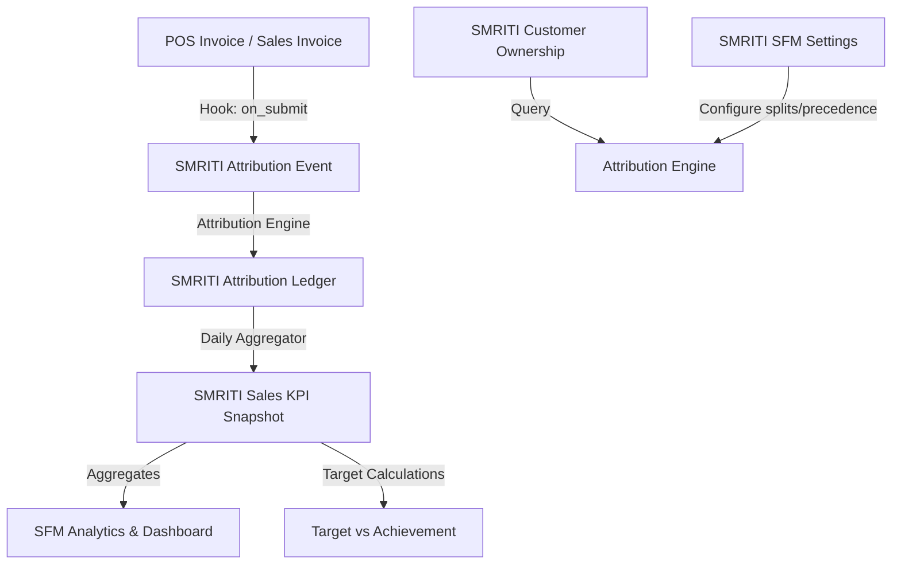

# SMRITI Sales Force Management (SFM) — Architecture Blueprint (v1.0.0)

---

### Author Profile (Start)
* **Author**: Jawahar R. Mallah
* **Designation**: Founder & Chief Architect
* **Organization**: AITDL – AI Technology & Development Lab
* **Professional Experience**: 20+ Years of Experience in Software Development, Retail Technology, Distribution Systems, POS Solutions, ERP Implementations, Business Process Automation, and Enterprise Application Design.

#### Author Note
This architecture guide is based on practical field experience gathered across retail operations, distribution management, inventory control, software architecture, business automation, and enterprise solution development. The objective is to make SMRITI Retail OS understandable and usable by both technical and non-technical users.

> "Light begins with learning."
> 
> — Jawahar R. Mallah
> Founder & Chief Architect, AITDL

---

## 1. Architectural Philosophy

SMRITI SFM is designed as a frontend experience and business intelligence layer sitting on top of the native ERPNext transaction engine. It adheres strictly to the following core SMRITI principles:

1. **ERPNext-First**: Reuse existing master data. `Employee` is the single source of truth for sales personnel. `Customer` is the single source of truth for clients.
2. **Ledger-Driven Attribution**: Revenue credits are recorded in an immutable ledger (`SMRITI Attribution Ledger`), separating operational transactions from downstream analytics and commissions.
3. **Auditability**: Every attribution decision must be traceable, explaining how a sale was allocated (Primary, Secondary, Walk-In, or Service).
4. **Timeline Integrity**: Ownership relationships have explicit `start_date` and `end_date` bounds, eliminating overlaps and preserving historical records (Rule SFM-ARC-001).
5. **Decoupled Stores**: Ledgers attribute sales to `SMRITI Store` entities rather than individual stock warehouses (Rule SFM-ARC-002).
6. **KPI Snapshots**: High-frequency queries read from pre-aggregated `SMRITI Sales KPI Snapshot` rows, avoiding large scans on raw ledger entries (Rule SFM-ARC-003).

---

## 2. Component Layout

---

## 3. Data Flow Diagram

1. **Event Capture**: An invoice is submitted in POS or backend.
2. **Hook Trigger**: `doc_events` triggers the `process_invoice_submit` method in SMRITI's SFM service.
3. **Attribution Engine**:
   - Check `SMRITI SFM Settings` for split ratios (`primary_split_pct`, `secondary_split_pct`) and fallback options.
   - Check `SMRITI Customer Ownership` for active owner records where `posting_date` falls between `start_date` and `end_date`.
   - If found: Retrieve Primary Owner and (optional) Secondary Owner.
   - If not found: Query `tabSales Team` inside the invoice for list of assigned salespersons, mapping each to their linked `Employee` records.
4. **Ledger Generation**:
   - Create one `SMRITI Attribution Ledger` entry per employee receiving credit.
   - Allocate `revenue_credit` mapped to `SMRITI Store` and `Warehouse` (optional).
   - Set status as `Active`, `Superseded`, or `Reversed` (Rule SFM-GOV-001).
5. **Snapshotting**:
   - A daily cron job/trigger aggregates active ledger rows into `SMRITI Sales KPI Snapshot` records grouped by Employee, Store, Date, and Company.
6. **Reversals**: When an invoice is cancelled, the engine processes `process_invoice_cancel`, which looks up the original entries and creates matching negative ledger entries with status `Reversed`.
