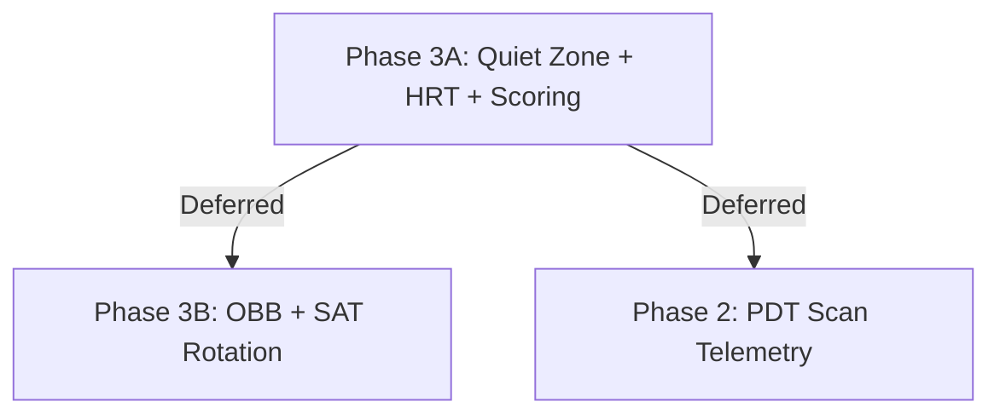

# ACP-BARCODE-001 — BARCODE QUIET ZONE, VIRTUAL HRT, AND PRINTABILITY SCORE ENGINE

## Document Classification
* **Document ID:** ACP-BARCODE-001
* **Version:** 1.0
* **Status:** APPROVED (Chief Architect Governance Review)
* **Authority:** SMRITI Governance Framework
* **Owner:** Jawahar R. Mallah, Founder & Chief Architect
* **Organization:** AITDL
* **Effective Date:** 2026-06-20

---

## 1. Author Profile & Credibility

### Author Profile
- **Author:** Jawahar R. Mallah
- **Designation:** Founder & Chief Architect
- **Organization:** AITDL – AI Technology & Development Lab
- **Professional Experience:** 20+ Years of Experience in Software Development, Retail Technology, Distribution Systems, POS Solutions, ERP Implementations, Business Process Automation, and Enterprise Application Design.

### Author Note
This manual is based on practical field experience gathered across retail operations, distribution management, inventory control, software architecture, business automation, and enterprise solution development. The objective is to make SMRITI Retail OS understandable and usable by both technical and non-technical users.

### Quote
> "Light begins with learning."
> 
> — Jawahar R. Mallah
> Founder & Chief Architect, AITDL

---

## 2. Background & Gap Analysis

SMRITI Barcode Studio has evolved from a basic ZPL/TSPL template editor into a virtual Print CAD system that simulates physical thermal printing outputs. However, current layout validations (`validate_layout_diagnostics`) have three primary gaps that can lead to misaligned or unscannable labels in retail environments:

1. **Barcode Quiet Zone Encroachment:** Scanners fail to read barcodes if surrounding text or boxes invade the quiet zones (margins) immediately to the left and right of the barcode symbol.
2. **Invisible Human Readable Text (HRT) Overlaps:** Printers natively render numerical labels below barcodes (HRT), but visual layout validation only checks the barcode's structural lines, causing undetected overlaps with labels positioned beneath the barcode.
3. **Lack of Printability Usability Indicators:** Non-technical Store Managers have no metric to gauge the reliability and safety of a design template prior to large-scale printing runs.

---

## 3. Approved Technical Specifications

To address these gaps without introducing unnecessary complexity, the following architecture is approved:

### 3.1. Dynamic Quiet Zone Validation (AABB Extension)
The collision engine will continue utilizing Axis-Aligned Bounding Box (AABB) checks, but will dynamically inflate the bounding box width `w` of barcode elements to reserve EAN-13/Code-128 quiet zones.
* **Quiet Zone Sizing Rule:** 
  * Left padding: $2.9\,\text{mm}$ (or $9\times$ module width)
  * Right padding: $2.5\,\text{mm}$ (or $7\times$ module width)
* **Mathematical Bound Adjustments:**
  * $\text{Effective } X = X - \text{Padding}_{\text{left}}$
  * $\text{Effective } W = W + \text{Padding}_{\text{left}} + \text{Padding}_{\text{right}}$
  
### 3.2. Configurable Virtual HRT Reservation
Instead of hardcoding the space allocated for barcode numbers, the offset height will be configurable:
* **Settings DocType:** `SMRITI Barcode Settings`
* **Configuration Parameter:** `barcode_hrt_reserved_height_mm` (Default: `2.5`)
* **Collision Check:** The validator will automatically inject an invisible text block immediately below the barcode element:
  * $\text{Virtual } Y = Y_{\text{barcode}} + H_{\text{barcode}}$
  * $\text{Virtual } H = \text{Settings.barcode\_hrt\_reserved\_height\_mm}$
  * $\text{Virtual } W = W_{\text{barcode}}$

### 3.3. Printability Score Engine (`SMRITI-PRN-SCORE-01`)
A weighted quality scorecard will evaluate each template and generate a score out of 100:

| Metric Group | Weight | Criteria |
| :--- | :--- | :--- |
| **Margin Safety** | 25 | Deduct 25 points if any barcode/QR element overlaps the 1.5mm safe margin |
| **Barcode Safety**| 25 | Deduct 25 points if any barcode quiet zone is invaded |
| **Text Overflow** | 20 | Deduct 5 points per warning for potential text container truncation |
| **Density Index** | 15 | Deduct 10 points if barcode line density is too high for a 203 DPI printer |
| **Collision Risk**| 15 | Deduct 15 points if non-decorative elements collide |

The grading scale is defined as:
* **90 – 100:** Grade A (Print Safe)
* **75 – 89:** Grade B (Monitor Warnings)
* **Below 75:** Grade F (Blocked from Printing)

---

## 4. Formula Registry Registration

To satisfy **Rule 11 (Formula Registry Policy)**, the Printability Score metric is registered with the following metadata:

* **Formula ID:** `SMRITI-PRN-SCORE-01`
* **Formula Name:** Printability Score v1.0
* **Category:** Operational Quality Metric
* **Owner:** Barcode Studio
* **Explainability:** Required (ⓘ Explain Modal support)
* **Caching:** Allowed (TTL 3600 seconds)
* **Audit Logging:** Mandatory

---

## 5. Phased Roadmap

* **Phase 3A (Current Sprint):** Focus on AABB extensions (Quiet Zones & HRT) and the Printability Score Engine.
* **Phase 3B (Future Phase):** Introduce Oriented Bounding Boxes (OBB) using Separating Axis Theorem (SAT) math only if dynamic layout rotation is officially approved.
* **Phase 2 PDT (Future Phase):** Create `ACP-BARCODE-002` to define and implement POS telemetry events (`custom_scan_status`, `custom_scan_attempts`) to analyze physical scanning failure correlations.
