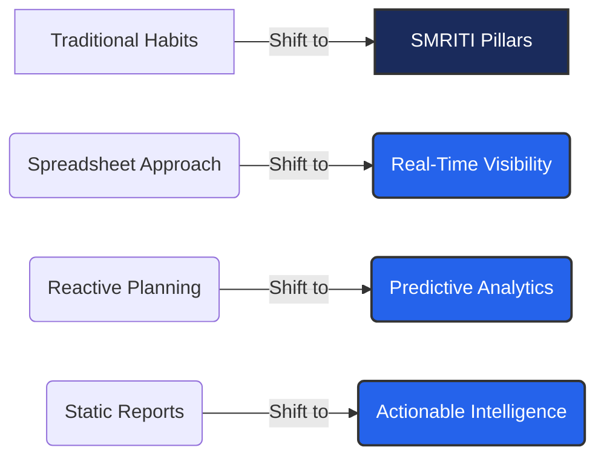

# SMRITI PSV Competitive Positioning Guide
## SMRITI Inventory Visibility Sales Enablement Suite

---

### Author Profile (Start)
- **Author**: Jawahar R. Mallah
- **Designation**: Founder & Chief Architect
- **Organization**: AITDL – AI Technology & Development Lab
- **Professional Experience**: 20+ Years of Experience in Software Development, Retail Technology, Distribution Systems, POS Solutions, ERP Implementations, Business Process Automation, and Enterprise Application Design.
- **Author Note**: This positioning guide is designed to equip our sales, consulting, and implementation teams with the right strategic narratives. It focuses on value-based comparisons rather than competitor feature checklist battles.

> "Light begins with learning."
> 
> — Jawahar R. Mallah
> Founder & Chief Architect, AITDL

#### Document Metadata
- **Document Version**: 1.0.0
- **Release Date**: 2026-06-23
- **Intended Audience**: Sales Engineers, Brand Consultants, Channel Partners, and Account Executives.
- **Learning Objectives**: Articulate the key differences between traditional retail tracking methods and SMRITI's modern Inventory Visibility Network.

---

## 🎯 Strategic Positioning Framework

SMRITI PSV does not compete against other ERPs or standalone inventory tools on raw features. Instead, we compete against **inefficient habits, operational blind spots, and lagging tools**. Our competitive positioning focuses on three core pillars:

---

## 📊 Dimension 1: Spreadsheet Approach vs. Visibility Network

### Comparison Matrix
| Feature | Spreadsheet Approach | SMRITI Visibility Network |
| :--- | :--- | :--- |
| **Data Recency** | Weekly/Monthly batch updates (Delayed). | Real-time secondary sales sync. |
| **Data Integrity** | High risk of manual copy-paste formulas and error overrides. | Automatic validation, MD5 validation, and checksum checks. |
| **Visibility Scope** | Brand central warehouse only; distributor stock is a black box. | End-to-end network tracking (Factory to Retail Cash Counter). |
| **Planner Productivity** | Planners spend 80% of time compiling data and 20% analyzing it. | Planners spend 5% of time on uploads and 95% on actions. |
| **Error Handling** | Errors are buried in broken rows; discovered only during stock audits. | Central Exception Monitoring Center flags mismatches immediately. |

### The Strategic Narrative
Traditional distribution operations run on spreadsheets (Excel, Google Sheets). The brand sends stock, and once a week, the distributor's clerk manual-types an inventory sheet and emails it to the brand planner. 

By the time the planner compiles these files across 20 distributors:
*   The data is already **5 to 7 days out of date**.
*   High-demand sizes have already sold out, costing the brand potential revenue.
*   Manual keying errors introduce inaccuracies that lead to bad reorder choices.

**SMRITI's Visibility Network** automates this flow. Distributors drop their daily sales export into the secure portal, and SMRITI instantly updates the **Inventory Visibility Layer**. Planners see active, validated inventory levels across all locations in real-time, moving the brand from delayed spreadsheets to continuous operational visibility.

---

## 🔮 Dimension 2: Reactive Planning vs. Predictive Analytics

### Comparison Matrix
| Feature | Reactive Planning | SMRITI Predictive Analytics |
| :--- | :--- | :--- |
| **Trigger Mechanism** | Distributor runs out of stock and places a high-priority order. | System computes Weeks of Cover (WOC) and triggers warnings. |
| **Fulfillment Mode** | Expedited air shipping, leading to high logistics costs. | Optimized regional dispatches and planned supply chain runs. |
| **Stockout Protection** | Defensive (replenishes stock *after* the stockout occurs). | Offensive (identifies depletion paths 10-14 days in advance). |
| **Variant Allocations** | Flat ratios (e.g., shipping standard boxes containing all sizes). | Dynamic Size Curves adjusted to match local outlet demand. |
| **Supply Chain Stress** | High. Constant emergency orders disrupt factory schedules. | Low. Stable production forecasting based on consumer checkout rates. |

### The Strategic Narrative
Most retail brands plan reactively. They only know a distributor is out of stock when the distributor calls demanding an urgent replenishment delivery. 

This reactive stance has direct business costs:
*   **Lost Revenue**: The outlet has already spent 5 days without stock, losing sales to competitors.
*   **High Freight Expenses**: The brand pays for emergency express logistics to ship replacement boxes.
*   **Distributor Friction**: Distributors feel the brand's service levels are unreliable.

**SMRITI's Predictive Analytics** switches the brand to an offensive strategy. SMRITI continuously calculates the **Weeks of Cover (WOC)** and **Days to Stockout** for each SKU. If a popular sneaker size drops below 3 weeks of cover, the system flags it in the *Watch Zone* weeks before it depletes. This allows planners to consolidate shipments, schedule standard logistics, and prevent the stockout before the customer walks in.

---

## 💡 Dimension 3: Static Reports vs. Actionable Intelligence

### Comparison Matrix
| Feature | Static Reports | SMRITI Actionable Intelligence |
| :--- | :--- | :--- |
| **Output Type** | PDF tables, charts, and raw CSV files. | Actionable recommendations and interactive workflows. |
| **Decision Load** | High. Planner must manually cross-reference 5 files to make a choice. | Low. System suggests the exact action (e.g. transfer source & quantity). |
| **Excess Stock Strategy** | Run store-wide markdown promotions, eroding gross margins. | Network Stock Transfers (NST) to locations with active demand. |
| **Metric Transparency** | None. Metrics are "black-box" outputs generated by complex scripts. | ⓘ Explain Modal provides clear formulas and worked calculations. |
| **Business Alignment** | Focuses on ledger records rather than channel productivity. | Focuses on capital efficiency, freshness, and distributor margins. |

### The Strategic Narrative
Traditional ERPs and BI tools generate static reports. They present long tables of stock numbers and sales figures, leaving the planner with the burden of figuring out what to do.

To resolve a regional stockout under a static reporting setup, a planner must:
1.  Open the Sales Report to find low-stock stores.
2.  Open the Inventory Report to find stores with excess stock.
3.  Open the Transit/Freight table to check transfer costs.
4.  Manually compute if transferring the stock makes business sense.
This manual process is slow and often leads to decision fatigue.

**SMRITI's Actionable Intelligence** does the calculation for you. It matches excess stock in one location with demand in another, computes the **Transfer Benefit Score (TRF-001)** (Margin Gain minus Freight Cost), and presents a simple transfer recommendation. The planner only needs to review the suggestion and click *Approve*, converting raw data into immediate business value.

---

### Summary: SMRITI PSV Competitive Positioning Matrix

| Traditional Approach | Traditional Result | SMRITI PSV Approach | SMRITI Business Outcome |
| :--- | :--- | :--- | :--- |
| **Spreadsheets** | 7-day data delay; manual entry errors; blind channel. | **Real-Time Visibility Network** | Current stock view; automated validation; clean data audits. |
| **Reactive** | Emergency shipments; stockout revenue losses; high freight. | **Predictive WOC Analytics** | 14-day stockout warnings; optimized logistics; protected sales. |
| **Static Reports** | Decision fatigue; manual calculations; margin-eroding markdowns. | **Actionable Intelligence & NST** | Recommended stock transfers; capital release; margin protection. |

---

### Author Profile (End)
- **Author**: Jawahar R. Mallah
- **Designation**: Founder & Chief Architect
- **Organization**: AITDL – AI Technology & Development Lab
- **Professional Experience**: 20+ Years of Experience in Software Development, Retail Technology, Distribution Systems, POS Solutions, ERP Implementations, Business Process Automation, and Enterprise Application Design.

> "Light begins with learning."
> 
> — Jawahar R. Mallah
> Founder & Chief Architect, AITDL

---
*SMRITI Sales Enablement Suite — Competitive Positioning Guide v1.0.0 | AITDL Network*
