# SMRITI PSV Sales Demo Script (30-Minute Sales Flow)
## SMRITI Inventory Visibility Sales Enablement Suite

---

### Author Profile (Start)
- **Author**: Jawahar R. Mallah
- **Designation**: Founder & Chief Architect
- **Organization**: AITDL – AI Technology & Development Lab
- **Professional Experience**: 20+ Years of Experience in Software Development, Retail Technology, Distribution Systems, POS Solutions, ERP Implementations, Business Process Automation, and Enterprise Application Design.
- **Author Note**: This demo script is based on practical field experience gathered across retail operations, distribution management, inventory control, software architecture, business automation, and enterprise solution development. The objective is to make SMRITI Retail OS understandable and usable by both sales teams and retail executives.

> "Light begins with learning."
> 
> — Jawahar R. Mallah
> Founder & Chief Architect, AITDL

#### Document Metadata
- **Document Version**: 1.0.0
- **Release Date**: 2026-06-23
- **Intended Audience**: Sales Engineers, Account Executives, Channel Managers, and Retail Directors.
- **Learning Objectives**: Enforce a structured, repeatable, and high-impact 30-minute demo flow that highlights the business benefits of the SMRITI PSV system.

---

## ⏱️ The 30-Minute Demo Timeline

```mermaid
gantt
    title SMRITI PSV Demo Flow (30 Minutes)
    dateFormat  X
    axisFormat %s
    section Core Demo
    Problem Discovery (M1-3) :active, 0, 3
    Visibility Gap (M4-8) : 3, 8
    Weeks of Cover (M9-12) : 8, 12
    Sell-Through Tracker (M13-16) : 12, 16
    Stock Transfers (M17-20) : 16, 20
    ROI Calculator (M21-25) : 20, 25
    Closing & Agreement (M26-30) : 25, 30
```

---

## 🎤 Detailed Step-by-Step Script

### Phase 1: Problem Discovery (Minutes 1–3)
**Objective**: Empathize with the prospect and uncover their pain points around channel inventory blind spots.

*   **Presenter Action**: Start with a blank dashboard or a high-level overview slide. Focus on the client's current setup.
*   **Scripted Dialogue**:
    > "Thank you for taking the time to meet today. Before I show you the SMRITI platform, let's discuss a common challenge retail brands face. When you ship 1,000 cases of shoes to your regional distributors, do you know exactly how many are sold to end-consumers by Friday night? Or does that inventory become a 'black box' until they place their next order?
    >
    > Traditional ERPs tell you what you *shipped*—Primary Sales. But they leave you blind to what actually *sold*—Secondary Sales. Today, we will look at how SMRITI bridges this gap to protect your margins and release locked capital."

*   **Key Discovery Questions to Ask**:
    1. *"How do you currently track stock levels at your partner distributors? Is it weekly Excel sheets, phone calls, or guesswork?"*
    2. *"What percentage of your catalog ends up in end-of-season clearance because a distributor was overstocked?"*

---

### Phase 2: Unveiling the Visibility Gap (Minutes 4–8)
**Objective**: Show how SMRITI visualizes the distribution network and exposes the "Blind Channel" problem.

*   **Presenter Action**: Navigate to **Slide 2 & 3 of the SMRITI Experience Center** (or the corresponding SMRITI dashboard). Highlight the multi-location Inventory Visibility Network.
*   **Scripted Dialogue**:
    > "Let's open the SMRITI Inventory Visibility Network. What you are seeing here is not another ERP ledger. SMRITI sits on top of your existing ERPNext transaction engine and aggregates secondary sales uploads.
    >
    > Look at this scenario: We shipped 1,000 units to our Mumbai distributor. In your standard books, that is registered as a ₹10,00,000 sale. But look at SMRITI's real-time visibility layer. We can see that the distributor still has 600 units in their warehouse, and retailers have 250 units on their shelves. Only 150 units have actually crossed the retail cash counter. 
    >
    > If you rely only on dispatch reports, you might manufacture another 1,000 units next week, compounding a massive overstock trap. SMRITI gives you the truth before you make production commitments."

---

### Phase 3: Weeks of Cover (WOC) Alert Zones (Minutes 9–12)
**Objective**: Demonstrate how SMRITI translates complex inventory balances into actionable, time-based indicators.

*   **Presenter Action**: Open **Slide 4: Weeks of Cover Dashboard**. Click on the WOC interactive calculator widget to show dynamic threshold adjustments.
*   **Scripted Dialogue**:
    > "Planners don't have time to review spreadsheet rows for 500 SKUs. SMRITI solves this with **Weeks of Cover (WOC)**, which measures how many weeks your current stock will last based on actual weekly sales velocity.
    >
    > Look at our dynamic Action Zones:
    > *   **Green Zone (7-14 Weeks)**: Stock is healthy. No action required.
    > *   **Watch Zone (3-7 Weeks)**: Warning zone. Stock is depleting. SMRITI alerts you to queue shipments.
    > *   **Action Zone (< 3 Weeks)**: Critical. High risk of stockouts.
    >
    > Let's look at this worked example. Our Pune depot holds **300 units** of a popular sneaker style. Their average sales velocity is **5 units per day**, which means **35 units per week**. By dividing 300 by 35, SMRITI calculates that Pune has **8.57 Weeks of Cover**—putting them safely in the Green Zone. But if sales suddenly spike to 15 units per day, the weekly velocity rises to 105 units, and Pune's WOC drops to **2.8 weeks**—instantly flashing red in the Action Zone. SMRITI flags this automatically, so you can prevent the stockout before it happens."

---

### Phase 4: Distributor Sell-Through Tracker (Minutes 13–16)
**Objective**: Explain how to track sell-through efficiency to make smarter allocation decisions.

*   **Presenter Action**: Move to **Slide 5: Sell-Through Performance**. Filter by category (e.g. Footwear) and distributor (Mumbai).
*   **Scripted Dialogue**:
    > "Sell-Through % is the ultimate metric for measuring retail velocity. It tells you what percentage of the inventory dispatched to a distributor has actually been sold to retailers and consumers.
    >
    > Let's use our standard formula: `(Units Sold / Units Shipped) * 100`. In our Mumbai depot, we shipped 1,500 units of denim last month. The distributor's secondary uploads show 900 units sold. SMRITI instantly computes a **60% Sell-Through rate**. 
    >
    > SMRITI ranks your distributors and styles. If you see a style with a Sell-Through rate above 70%, SMRITI recommends allocating more budget to that line. If a style is struggling below 30%, SMRITI flags a freeze on further shipments, saving you from pileups."

---

### Phase 5: Balancing Network Stock via Transfers (Minutes 17–20)
**Objective**: Show how SMRITI helps distributors balance inventory without buying new stock from the brand.

*   **Presenter Action**: Navigate to **Slide 7: Store-Wise Matrix & Transfers**. Focus on the Size-wise Matrix.
*   **Scripted Dialogue**:
    > "Sometimes, you don't need to manufacture more inventory. You just need to move it to the right place. 
    >
    > Look at this matrix: Our Mumbai depot has 250 excess units of Size 6 blue sneakers, representing a WOC of 30 weeks. Meanwhile, Pune is completely stocked out of Size 6, losing sales daily.
    >
    > Instead of shipping new boxes from the factory—which takes 10 days and incurs manufacturing costs—SMRITI recommends a **Network Stock Transfer (NST)**. It suggests moving 100 units from Mumbai to Pune. Pune gets stock in 2 days to capture sales, Mumbai clears excess capital lockup, and overall brand margins are preserved."

---

### Phase 6: Interactive ROI Calculator (Minutes 21–25)
**Objective**: Prove the financial value of the platform using the prospect's own numbers.

*   **Presenter Action**: Open the **SMRITI ROI Calculator Tool**. Input mock numbers (e.g. ₹5,00,00,000 annual sales, 8% stockout rate, 30% gross margin) to show live calculations.
*   **Scripted Dialogue**:
    > "Let's see what this means for your bottom line. If your annual channel sales are ₹5 Crores, and you experience a standard 8% stockout rate on popular sizes, you are losing ₹40 Lakhs in top-line revenue every year.
    >
    > By implementing SMRITI PSV and reducing those stockouts by just half—down to 4%—you recover ₹20 Lakhs in lost sales. At a 30% gross margin, that is **₹6,00,000 in pure profit returned straight to your business**.
    >
    > Additionally, by identifying dead stock early and initiating stock transfers, we can release 15% of your locked working capital. On ₹1 Crore of average network inventory, that is **₹15,00,000 in cash released back to your bank account** to invest in faster-moving lines."

---

### Phase 7: Closing & Next Steps (Minutes 26–30)
**Objective**: Resolve objections, establish consensus, and secure a pilot program.

*   **Presenter Action**: Display the **Go-Live Checklist** slide or summary.
*   **Scripted Dialogue**:
    > "Getting started is straightforward. We don't ask your distributors to change their accounting systems. SMRITI connects to their existing setup using simple, secure daily file uploads.
    >
    > We recommend starting with a **30-day Pilot Program** covering one product category and three key distributors (e.g. Mumbai, Pune, and Nashik). Our team handles the configuration, data mapping, and planner onboarding.
    >
    > Let's review the onboarding checklist to schedule our kickoff session next week. Who on your inventory team should be the primary contact?"

---

### Author Profile (End)
- **Author**: Jawahar R. Mallah
- **Designation**: Founder & Chief Architect
- **Organization**: AITDL – AI Technology & Development Lab
- **Professional Experience**: 20+ Years of Experience in Software Development, Retail Technology, Distribution Systems, POS Solutions, ERP Implementations, Business Process Automation, and Enterprise Application Design.

> "Light begins with learning."
> 
> — Jawahar R. Mallah
> Founder & Chief Architect, AITDL

---
*SMRITI Sales Enablement Suite — Demo Script v1.0.0 | AITDL Network*
