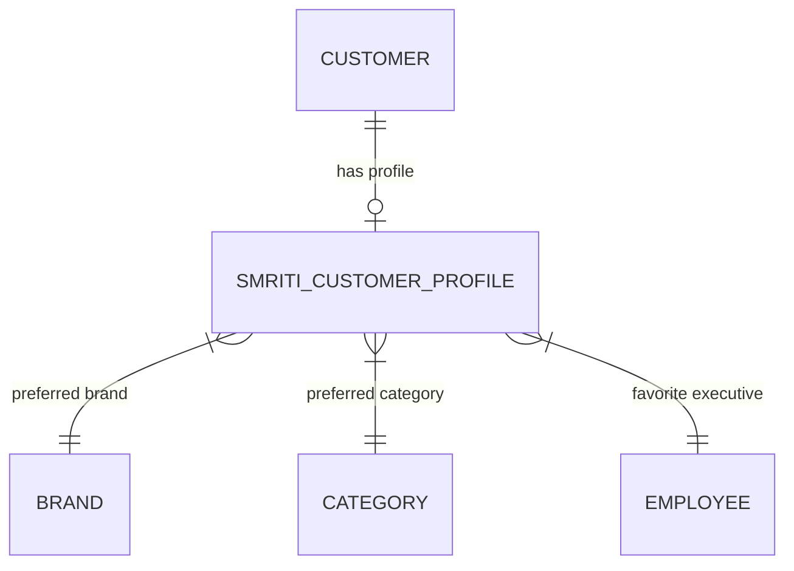

# SMRITI Clienteling Engine — Architecture Blueprint v1.0

---

### Author Profile (Start)
* **Author**: Jawahar R. Mallah
* **Designation**: Founder & Chief Architect
* **Organization**: AITDL – AI Technology & Development Lab
* **Professional Experience**: 20+ Years of Experience in Software Development, Retail Technology, Distribution Systems, POS Solutions, ERP Implementations, Business Process Automation, and Enterprise Application Design.

#### Author Note
This architecture blueprint defines the next logical milestone of SMRITI Retail OS: the Customer Intelligence Layer. By converting transactional, loyalty, and predictive data into a unified, read-only clienteling layer at the POS checkout, we empower sales associates to deliver personalized, high-conversion customer interactions.

> "Light begins with learning."
> 
> — Jawahar R. Mallah  
> Founder & Chief Architect, AITDL

---

## 1. Domain Scope & Bounded Context

As part of the **SMRITI Customer Intelligence Layer**, the **Clienteling Engine** translates multi-channel transactions, CGE marketing metrics, and PDT predictive insights into actionable ground-level store execution at the POS.

```
CGE (Campaigns / Loyalty)
     ↓
SFM (Sales Attribution)
     ↓
SFC (Ledger Payouts)
     ↓
CLIENTELING (POS Personalization)
```

- **Read-Only Bounded Context**: `SMRITI Customer Profile` is a strictly derived, read-only document. Store associates, cashiers, and managers cannot manually edit or overwrite clienteling profile metrics. All values are auto-computed from historical data.
- **POS Checkout Integration**: When a customer is selected at the POS, the terminal automatically retrieves the clienteling profile in-memory and displays high-probability purchase predictions and preferences.

---

## 2. Proposed Data Model

### `SMRITI Customer Profile` DocType
This DocType holds the aggregated clienteling profile per customer.

- **Key Fields**:
  - `customer` (Link -> Customer, PK)
  - `preferred_brand` (Link -> Brand)
  - `preferred_category` (Link -> Category)
  - `preferred_size` (Data)
  - `preferred_color` (Data)
  - `last_visit_date` (Date)
  - `visit_frequency_days` (Float)
  - `favorite_executive` (Link -> Employee)
  - `average_basket_value` (Currency)
  - `likely_purchase_prediction` (Data)
  - `prediction_confidence` (Percent)



---

## 3. Data Sources & Extraction Pipeline

The clienteling engine aggregates data periodically from six core SMRITI and ERPNext data sources:

1.  **Sales History (`tabSales Invoice`)**: Determines buying frequency, average basket value, and color/size preferences.
2.  **Returns (`tabSales Invoice` with `is_return = 1`)**: Filters out items with high return rates to refine preferences.
3.  **CGE (`tabSMRITI Loyalty Ledger`)**: Reads active reward tiers, wallet balances, and preferred coupon types.
4.  **Attribution (`tabSMRITI Attribution Ledger`)**: Identifies which sales executives successfully closed previous transactions.
5.  **Loyalty (`tabSMRITI Member Tier`)**: Retrieves current customer tier and point balances.
6.  **PDT (`tabSMRITI Product Digital Twin`)**: Generates predictive next-purchase recommendations.

---

## 4. PDT ↔ Clienteling ↔ POS Integration

To maximize basket conversion at checkout, SMRITI integrates the Product Digital Twin (PDT) and Clienteling profiles directly into the checkout lane:

```
POS Customer Selection
       ↓
Fetch SMRITI Customer Profile (Read-Only)
       ↓
Invoke PDT Recommendation Engine (API Call)
       ↓
Render POS Overlay:
- Preferred Size/Color/Brand Profile
- "Likely Purchase: Levi's 511 (82% Confidence)"
- Suggestion: "Show matching leather boots"
```

---

## 5. Executive Relationship Performance KPIs

Move beyond basic volume targets to relationship-first sales performance metrics:

### Relationship Revenue Index (RRI)
Measures the percentage of an executive's sales generated from customers they "own" (assigned customer base) vs walk-ins:
$$RRI = \left( \frac{\text{Owned Customer Revenue}}{\text{Total Attributed Revenue}} \right) \times 100$$

### Retention Influence Score (RIS)
Counts the number of repeat customers successfully re-engaged and checked out by the specific sales executive within a 90-day window:
$$RIS = \text{Count of unique repeat customers checked out by Executive}$$

### Growth Contribution (GC)
Calculates year-over-year or month-over-month revenue growth from the executive's assigned customer portfolio:
$$GC = \text{Current Month Assigned Revenue} - \text{Baseline Assigned Revenue}$$

---

### Author Profile (End)
* **Author**: Jawahar R. Mallah
* **Designation**: Founder & Chief Architect
* **Organization**: AITDL – AI Technology & Development Lab
* **Professional Experience**: 20+ Years of Experience in Software Development, Retail Technology, Distribution Systems, POS Solutions, ERP Implementations, Business Process Automation, and Enterprise Application Design.

> "Light begins with learning."
> 
> — Jawahar R. Mallah  
> Founder & Chief Architect, AITDL
