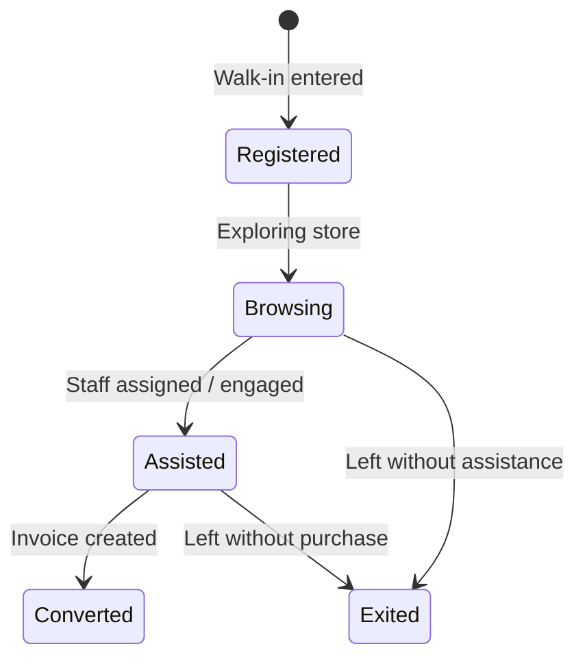

# SMRITI Unified Customer Graph — Architecture Specification v1.1

---

### Author Profile (Start)
* **Author**: Jawahar R. Mallah
* **Designation**: Founder & Chief Architect
* **Organization**: AITDL – AI Technology & Development Lab
* **Professional Experience**: 20+ Years of Experience in Software Development, Retail Technology, Distribution Systems, POS Solutions, ERP Implementations, Business Process Automation, and Enterprise Application Design.

#### Author Note
This architecture specification defines the core Unified Customer Graph layer of SMRITI Retail OS. By decoupling the background system-level data aggregation from the high-performance presentation profile, we ensure fast checkout response times and a clean database state for downstream intelligence components.

> "Light begins with learning."
> 
> — Jawahar R. Mallah  
> Founder & Chief Architect, AITDL

---

## 1. Core Architectural Pillars

SMRITI Customer Intelligence is split into two distinct, materialized layers to guarantee sub-10ms POS lookup times while maintaining deep operational traceability:

```
                  ┌──────────────────────────────┐
                  │   Primary Data Sources       │
                  │   (Invoices, Loyalty, SFM)   │
                  └──────────────┬───────────────┘
                                 │ Event / Hook (Mark Dirty with Audit Trail)
                                 ▼
                  ┌──────────────────────────────┐
                  │ SMRITI Customer Graph        │  ◄── Asynchronous Job Queue
                  │ (System Layer - Database)    │
                  └──────────────┬───────────────┘
                                 │ Compiles & Enriches
                                 ▼
                  ┌──────────────────────────────┐
                  │ SMRITI Customer Profile      │  ◄── PDT Signals & AI Copilot
                  │ (Presentation - Read-Only)   │
                  └──────────────────────────────┘
```

1. **System Layer (`SMRITI Customer Graph`)**: Aggregates primary ledger records (Sales, Returns, Campaigns, Attribution) and acts as the system database record.
2. **Presentation Layer (`SMRITI Customer Profile`)**: Consumes the Customer Graph and PDT signals to render a read-only, high-performance materialized snapshot for the POS and AI Retail Copilot.

---

## 2. System Layer: `SMRITI Customer Graph` Schema

A physical, indexed database table that stores raw consolidated customer parameters.

- **Primary Fields**:
  - `customer` (Link -> Customer, PK, Indexed)
  - `purchases_count` (Int): Total count of non-return invoices.
  - `returns_count` (Int): Total count of return invoices.
  - `net_revenue` (Currency): Net monetary value (Sales - Returns).
  - `wallet_balance` (Currency): Current loyalty balance.
  - `campaign_responses_count` (Int): Total interactions with CGE promotions.
  - `attributed_revenue` (Currency): Total sales value attributed via SFM.
  - `owned_customer_revenue` (Currency): Revenue matching `SMRITI Customer Ownership`.
  - `preferred_brand` (Link -> Brand): Brand with highest quantity purchased.
  - `preferred_category` (Link -> Item Group): Item Group with highest quantity.
  - `preferred_size` (Data): Footwear/Apparel size mode.
  - `preferred_color` (Data): Color mode.
  - `last_visit_date` (Date): Latest transaction date.
  - `visit_frequency_days` (Float): Mean interval in days between visits.
  - `favorite_executive` (Link -> Employee): Mode executive from the Attribution Ledger.
  - `is_dirty` (Check): Flag indicating pending recalculation.
  - `dirty_source` (Data): Audit trail - source of modification (e.g. "POS Invoice").
  - `dirty_document` (Data): Audit trail - document ID triggering change (e.g. "POS-00045").
  - `graph_version` (Data): Default: "v1". Version trace.
  - `calculation_status` (Select): "Pending", "Processing", "Completed", "Failed".
  - `last_calculated_on` (Datetime): Timestamp of last regeneration.

---

## 3. Presentation Layer: `SMRITI Customer Profile` Schema

A read-only presentation snapshot for instantaneous checkout lookup.

- **Primary Fields**:
  - `customer` (Link -> Customer, PK, Indexed)
  - `preferred_brand` (Link -> Brand)
  - `preferred_category` (Link -> Item Group)
  - `preferred_size` (Data)
  - `preferred_color` (Data)
  - `last_visit_date` (Date)
  - `visit_frequency_days` (Float)
  - `favorite_executive` (Link -> Employee)
  - `average_basket_value` (Currency): `net_revenue` / `purchases_count`.
  - `lifetime_value` (Currency): Net revenue.
  - `likely_purchase_prediction` (Link -> Item): Predicted next purchase SKU from PDT.
  - `prediction_confidence` (Percent): Confidence score from PDT.
  - `next_visit_prediction` (Date): Predicted next visit date from PDT.
  - `engagement_score` (Percent): Derived overall engagement rating.
  - `is_dirty` (Check): Flag indicating pending regeneration.
  - `dirty_source` (Data): Audit trail - source of modification.
  - `dirty_document` (Data): Audit trail - document ID.
  - `graph_version` (Data): Default: "v1". Version trace.
  - `calculation_status` (Select): "Pending", "Processing", "Completed", "Failed".
  - `last_calculated_on` (Datetime): Timestamp of last regeneration.

---

## 4. Relationship & Interaction Ledger

### `SMRITI Customer Interaction` DocType
Clienteling relies on tracking both transaction and touchpoint data. We introduce a structured interaction ledger.

- **Schema Fields**:
  - `customer` (Link -> Customer, Mandatory, Indexed)
  - `interaction_date` (Date, Mandatory, Default: Today)
  - `interaction_time` (Time, Mandatory, Default: Now)
  - `interaction_type` (Select: "Phone Call", "WhatsApp Follow-Up", "Birthday Greeting", "Store Visit", "Personal Shopping Session", "Other", Mandatory)
  - `employee` (Link -> Employee, Mandatory)
  - `interaction_outcome` (Select: "Interested", "Not Interested", "Follow-Up Required", "Converted", Mandatory)
  - `store` (Link -> Warehouse, Mandatory)
  - `channel` (Select: "In-Person", "WhatsApp", "Phone", "SMS", "Email", Mandatory)
  - `details` (Small Text): Content of interaction.
  - `ref_doc_type` (Data): Reference to associated DocType (e.g. Sales Invoice).
  - `ref_doc_name` (Data): Reference to associated Document Name.

---

## 5. Walk-In Event State Machine & snapshot governance

### Walk-In Funnel States


- **SMRITI Walk In Analytics Snapshot Governance**:
  `SMRITI Walk In Analytics` is a derived materialized snapshot, never manually edited or updated via client UI. It is regenerated from `SMRITI Walk In Visit` records exclusively.

---

## 6. Asynchronous Event-Driven Regeneration Strategy

To protect transaction processing speeds during peaks, database mutations mark the graph as dirty and schedule background updates.

```
Invoice Submit/Cancel
         │
         ▼
[Event Hook]
         │
         ▼
Mark `is_dirty = 1`, `calculation_status = "Pending"`, `dirty_source`, `dirty_document`
         │
         ▼
Enqueue Background Task (`frappe.enqueue`)
         │
         ▼
[Background Queue Execution]
  - Query primary ledgers
  - Recalculate Graph values
  - Recalculate Profile snapshot
  - Set `is_dirty = 0`, `calculation_status = "Completed"` or `"Failed"`
```

---

## 7. Mathematical KPIs & Central Formula Registry

These metrics are registered centrally in the `SMRITI Formula Registry` and must not be hardcoded in Python.

### A. Average Basket Value (ABV)
* **Code Key**: `ABV`
* **Formula Expression**: `net_revenue / purchases_count`
* **Variables**: `net_revenue` (Customer Graph), `purchases_count` (Customer Graph)
* **Interpretation**: Average value spent per non-return checkout.

### B. Lifetime Value (LTV)
* **Code Key**: `LTV`
* **Formula Expression**: `net_revenue`
* **Variables**: `net_revenue` (Customer Graph)
* **Interpretation**: Customer Lifetime Net Revenue.

### C. Relationship Revenue Index (RRI)
* **Code Key**: `RRI`
* **Formula Expression**: `(owned_customer_revenue / attributed_revenue) * 100`
* **Variables**: `owned_customer_revenue` (Customer Graph), `attributed_revenue` (Customer Graph)
* **Interpretation**: Tracks share of revenue from assigned customers.

### D. Walk-In Conversion Rate (WCR)
* **Code Key**: `WCR`
* **Formula Expression**: `(converted_visits / total_visits) * 100`
* **Variables**: `converted_visits` (Walk-In Visits with status "Converted"), `total_visits` (All Walk-In Visits)
* **Interpretation**: Percentage of footfalls resulting in sales.

---

### Author Profile (End)
* **Author**: Jawahar R. Mallah
* **Designation**: Founder & Chief Architect
* **Organization**: AITDL – AI Technology & Development Lab
* **Professional Experience**: 20+ Years of Experience in Software Development, Retail Technology, Distribution Systems, POS Solutions, ERP Implementations, Business Process Automation, and Enterprise Application Design.

> "Light begins with learning."
> 
> — Jawahar R. Mallah  
> Founder & Chief Architect, AITDL
