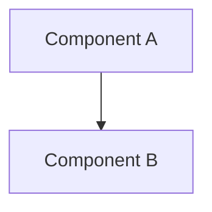

# Architecture Proposal / Blueprint Title

## Context & Problem Statement
Detail the context and the problem that this architecture design solves.

## Proposed Architecture
Explain the core components, design decisions, and data flow.

### Architecture Diagram (Mermaid)

## Service Layer Interface & API
Describe backend integration layers, decoupled services, or tokens.

## Explained Metrics & Formula Governance
If this architecture computes any KPI or metric, document the transparency registry details here:
- **Business Meaning**: What the metric tracks and why it is useful.
- **Formula Expression**: Mathematical representations.
- **Worked Example**: Worked calculation using realistic retail values.
- **Interpretation Guide**: Health thresholds and ranges.
- **Recommended Action**: Guidelines based on values.

## Related Documents
- [DOCUMENTATION_MANIFEST](../DOCUMENTATION_MANIFEST.md)

## Revision History

| Version | Date | Author | Summary of Changes |
| --- | --- | --- | --- |
| 1.0.0 | YYYY-MM-DD | [Author Name] | Initial creation |

**Author**: Jawahar R. Mallah  
**Designation**: Founder & Chief Architect  
**Organization**: AITDL – AI Technology & Development Lab  
**Experience**: 20+ Years of Experience in Software Development, Retail Technology, POS Solutions, and Enterprise Application Design.  

> "Always decision-ready."  
> — Jawahar R. Mallah
