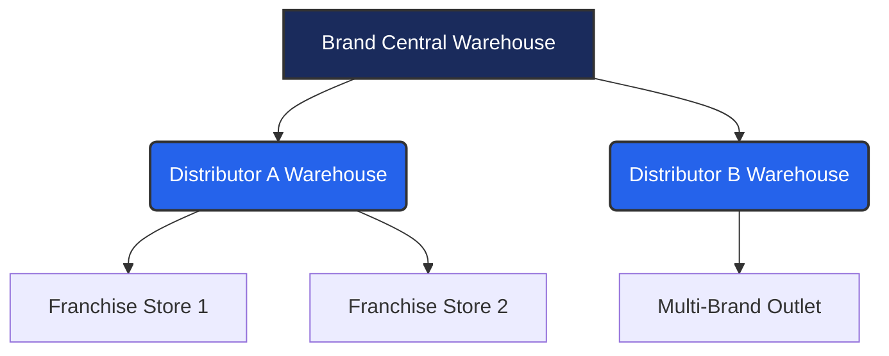

# Volume 6 — SMRITI Party Stock Visibility (PSV) User Manual

---

### Author Profile (Start)
* **Author**: Jawahar R. Mallah
* **Designation**: Founder & Chief Architect
* **Organization**: AITDL – AI Technology & Development Lab
* **Professional Experience**: 20+ Years of Experience in Software Development, Retail Technology, Distribution Systems, POS Solutions, ERP Implementations, Business Process Automation, and Enterprise Application Design.

#### Author Note
This manual is based on practical field experience gathered across retail operations, distribution management, inventory control, software architecture, business automation, and enterprise solution development. The objective is to make SMRITI Retail OS understandable and usable by both technical and non-technical users.

> "Light begins with learning."
> 
> — Jawahar R. Mallah
> Founder & Chief Architect, AITDL

#### Document Metadata
* **Document Version**: 1.0.0
* **Release Date**: 2026-06-23
* **Intended Audience**: CEO, Brand Managers, Sales Heads, Distributors, Warehouse Managers, and Store Controllers.
* **Learning Objectives**: Master distributor inventory tracking, reorder planning, stock transfer workflows, ROI calculation, and troubleshooting for Party Stock Visibility (PSV).
* **Support**: support@aitdl.example.com
* **Revision History**:
  * `v1.0.0` (2026-06-23): Initial compilation by Jawahar R. Mallah.

---

## Chapter 1 — Understanding the Distribution Visibility Gap

### 1. The Core Problem
For traditional retail brands selling through external channels, the moment inventory leaves the brand's primary warehouse, visibility is lost. ERPNext standard tracking only covers brand-owned warehouses. The distributor's stock status becomes a "black box" (अदृश्य क्षेत्र). This creates the **Distribution Visibility Gap**:

1. **The Blind Channel**: Brands have no real-time data on what styles or sizes are selling at the distributor location.
2. **The Excess Reorder Trap**: Distributors order slow-moving stock because they lack sales velocity metrics, leading to clogged warehouses.
3. **The Dead Stock Trap**: Seasonal merchandise sits unsold at distributor warehouses, locking up capital and resulting in return claims or forced discounts.
4. **Capital Blockage**: Cash is tied up in stagnant inventory instead of fast-selling styles.

### 2. Business Scenario
A brand sells footwear to a regional distributor.

```text
Brand Warehouse
   ↓ (Dispatches 1,000 units)
Distributor Warehouse (Has 600 units remaining)
   ↓ (Supplies to retailers)
Retailers (Have 250 units on shelves, 150 sold to consumers)
```

* **Without PSV**: The brand only sees a dispatch of 1,000 units. It assumes high demand and schedules production for another 1,000 units.
* **With PSV**: The brand sees that 600 units are still sitting at the distributor, and only 150 have been sold to actual end-consumers. The brand immediately halts production of slow-moving items and focuses on active styles.

---

## Chapter 2 — Inventory Visibility Network

### 1. Multi-Tiered Visibility Structure
SMRITI PSV connects all nodes in the distribution network into a single, unified view.



### 2. Multi-Location Inventory Tracking
SMRITI PSV monitors stock levels across:
1. **Primary Warehouses**: Brand-owned depots (tracked in ERPNext Stock Ledger).
2. **Distributor Locations**: Tracked via SMRITI shadow ledgers (Party Stock Accounts - PSA).
3. **Retail Outlets**: Sales and returns tracked through distributor uploads.

This ensures stock is visible at every point in the supply chain without mixing distributor stock with brand assets in the primary general ledger.

---

## Chapter 3 — Distributor Sell-Through Tracker

### 1. Primary vs. Secondary Sales
* **Primary Sales**: Stock sold by the brand to the distributor (recorded in ERPNext Sales Invoices).
* **Secondary Sales**: Stock sold by the distributor to retailers/consumers (tracked via SMRITI uploads).

### 2. Sell-Through %
The **Sell-Through %** measures how fast the distributor is selling the stock they received from the brand.

#### Formula:
$$\text{Sell-Through \%} = \left( \frac{\text{Units Sold}}{\text{Units Received}} \right) \times 100$$

#### Worked Example:
If a distributor receives 2,000 units of sneakers and sells 1,400 units:
$$\text{Sell-Through \%} = \left( \frac{1,400}{2,000} \right) \times 100 = 70.0\%$$

A high sell-through rate (>60%) indicates high customer demand and rapid product rotation.

---

## Chapter 4 — Weeks of Cover (WOC)

### 1. Business Definition
**Weeks of Cover (WOC)** calculates how many weeks the distributor's current stock will last based on their average weekly sales velocity.

#### Formula:
$$\text{WOC} = \frac{\text{Current Stock (Shadow Balance)}}{\text{Sales Velocity (Daily Average)} \times 7}$$

### 2. Inventory Alert Zones
SMRITI PSV monitors WOC and flags stock health in three distinct bands:

| Zone | WOC Range | Meaning & Action |
| :--- | :--- | :--- |
| **Green Zone** | 7 to 14 Weeks | **Healthy**: Stock level matches demand. No immediate action required. |
| **Watch Zone** | 3 to 7 Weeks | **Warning**: Stock is depletion-prone. Prepare next replenishment shipment. |
| **Action Zone** | < 3 Weeks | **Critical**: High stockout risk. Place immediate reorder. |

---

## Chapter 5 — Reorder & Replenishment Intelligence

### 1. Replenishment Mechanics
PSV calculates reorders dynamically using the following variables:
* **Lead Time**: Time required for stock to arrive after placing an order.
* **Safety Stock**: Buffer stock kept to cover sales spikes or transit delays.
* **Reorder Point (ROP)**: The stock level that triggers a replenishment order.

#### Formula:
$$\text{Reorder Point (ROP)} = (\text{Average Daily Sales} \times \text{Lead Time}) + \text{Safety Stock}$$

### 2. Worked Example
* Lead Time = 10 days
* Average Daily Sales = 20 units
* Safety Stock = 100 units
$$\text{ROP} = (20 \times 10) + 100 = 300\text{ units}$$
When the distributor's stock drops to 300 units, the system automatically triggers a Critical/High priority replenishment suggestion.

---

## Chapter 6 — Exception Monitoring Center

The Exception Center captures operational mismatches to prevent data corruption.

### Common Exceptions:

#### 1. Negative Shadow Balance
* **Symptom**: Stock level displays negative numbers on the dashboard.
* **Cause**: Sales uploads processed before the corresponding opening balance or dispatch invoices were imported.
* **Resolution**: Upload missing stock dispatch invoices or update opening stock.

#### 2. Return Mismatch
* **Symptom**: Distributor logs return of items that were never dispatched to them.
* **Cause**: Incorrect barcode scanned during return, or dispatch invoice was missed.
* **Resolution**: Verify item serial number against dispatch log.

#### 3. Coverage Alerts
* **Symptom**: Target coverage drops below 3 weeks.
* **Cause**: Sales velocity increased rapidly, or supply chain delay occurred.
* **Resolution**: Dispatch high-priority replenishment stock immediately.

---

## Chapter 7 — Store-wise Distribution Matrix

### 1. Size-wise & Color-wise Allocation
Standard inventory ledgers show total quantities. SMRITI PSV displays size-wise curve health (XS, S, M, L, XL, XXL) and color-wise variants.

#### Curve Matrix Example (Mumbai Outlet):
| Size | Stock Qty | Weekly Velocity | Status |
| :--- | :---: | :---: | :--- |
| **XS** | 10 | 1 | Excess |
| **S** | 12 | 2 | Balanced |
| **M** | 0 | 15 | **Stockout** |
| **L** | 1 | 18 | **Stockout** |
| **XL** | 15 | 1 | Excess |

### 2. Store Balancing
SMRITI identifies that Mumbai has excess XS and XL sizes, while Pune has demand for XS and XL but excess M and L sizes. SMRITI triggers a **Network Stock Transfer** recommendation to balance the inventory across stores.

---

## Chapter 8 — Capital Efficiency Analytics

### 1. Capital Locked Definition
**Capital Locked** measures the currency value of stagnant or slow-moving stock sitting in distributor warehouses.

#### Formula:
$$\text{Capital Locked} = \text{Stagnant Stock Qty} \times \text{Landed Cost}$$

### 2. Worked Example
A distributor maintains an inventory worth ₹50,00,000 at standard rates.
* **Active Stock**: ₹35,00,000 (selling regularly)
* **Dead Stock (Over 90 Days)**: ₹15,00,000
$$\text{Capital Locked \%} = \left( \frac{15,00,000}{50,00,000} \right) \times 100 = 30\%$$
* **Operational Goal**: Maintain Capital Locked under 20% to ensure high inventory productivity.

---

## Chapter 9 — Lead Time & Fulfillment Tracking

### 1. Supplier Lead Time Analysis
PSV tracks transit, check-in, and processing times. If lead time is set to 10 days, but actual delivery takes 15 days, WOC calculations adjust automatically to prevent stockouts.

### 2. Stockout Prediction
Using the formula:
$$\text{Days to Stockout} = \frac{\text{Current Stock}}{\text{Average Daily Sales}}$$
SMRITI predicts the exact date of depletion, giving the supply chain team advance warnings.

---

## Chapter 10 — Sell-Through Performance Dashboard

### 1. Category, Brand & Store Performance
The Sell-Through Dashboard provides macro filters to compare performance:
* **Category**: Compare Denim, Sneakers, T-Shirts, and Accessories.
* **Brand**: Track performance curves of different sub-brands.
* **Store**: Rank distributors and franchise outlets by sell-through efficiency.

### 2. Business Action
If Sneakers have 85% sell-through while Denim is at 25%, the system recommends shifting manufacturing budgets from Denim to Sneakers.

---

## Chapter 11 — Inventory Freshness & Aging

### 1. Inventory Aging Bands
PSV tracks stock freshness by calculating days since dispatch:

* **0–30 Days (Fresh)**: High demand window. Maximum margin potential.
* **31–60 Days (Active)**: Standard selling window. Normal margins.
* **61–90 Days (Aging)**: Slower rotation. Recommended for partial promotions.
* **90+ Days (Dead)**: Non-moving. High priority for clearance or transfer.

### 2. Target Aging Policy
Brands should maintain at least 80% of distributor inventory in the **Fresh** or **Active** bands.

---

## Chapter 12 — Network Stock Transfers

### 1. Inter-Store Inventory Balancing
Instead of shipping new inventory from the central factory, PSV recommends moving stock between distributors.

### 2. Scenario
* **Mumbai Store**: Has 200 excess pairs of blue sneakers (WOC = 35 weeks).
* **Pune Store**: Run out of blue sneakers (WOC = 0 weeks) with a weekly sales demand of 30 units.
* **System Action**: Recommend a Network Stock Transfer (NST) of 100 units from Mumbai to Pune.
* **Result**: Mumbai's excess is cleared, Pune's stockout is averted, and transport cost is lower than shipping from the central warehouse.

---

## Chapter 13 — Distribution ROI Calculator

### 1. Calculating ROI Optimization
Freed capital reinvested in high-demand stock increases distributor ROI without extra brand capital exposure.

### 2. Worked Example
* **Before PSV**:
  * Capital Invested: ₹20,00,000
  * Dead Stock: ₹8,00,000 (40% Capital Locked)
  * Annual Revenue: ₹40,00,000
  * Net Margin (10%): ₹4,00,000
  * **Distributor ROI**: $\left(\frac{4,00,000}{20,00,000}\right) \times 100 = 20.0\%$
* **After PSV**:
  * Dead Stock reduced by 50% (Freed ₹4,00,000).
  * ₹4,00,000 reinvested in high-velocity styles.
  * Reinvested capital generates ₹12,00,000 in additional sales.
  * New Annual Revenue: ₹52,00,000
  * New Net Margin Profit (10%): ₹5,20,000
  * **New Distributor ROI**: $\left(\frac{5,20,000}{20,00,000}\right) \times 100 = 26.0\%$

Distributor ROI improves from **20% to 26%** and brand sales volume grows by **30%**.

---

## Chapter 14 — Why Brands Choose PSV

Brands implement SMRITI PSV for the following outcomes:
1. **Lower Stockouts**: Avoid losing sales due to missing key sizes.
2. **Optimized Inventory**: Reduce overstocking of slow-moving variants.
3. **Higher Sell-Through**: Ensure stock is placed where it sells fastest.
4. **Capital Efficiency**: Keep working capital fluid by minimizing dead stock.
5. **Collaborative Planning**: Enable transparent inventory sharing with distributors.
6. **Improved Forecasting**: Drive manufacturing plans with real retail demand.
7. **Higher Network ROI**: Improve partner profitability, building long-term distributor loyalty.

---

## Chapter 15 — Executive Dashboard & Daily Review Guide

### 1. Daily KPI Review Parameters
Executives should review these 4 metrics daily to evaluate network status:

| KPI | Target | Meaning |
| :--- | :---: | :--- |
| **Weeks of Cover** | 4–8 Weeks | Average weeks before stockout. |
| **Sell-Through %** | >70% | Ratio of shipped inventory sold to consumers. |
| **Capital Locked** | <20% | Percentage of capital tied up in slow stock. |
| **Inventory Freshness** | >80% Fresh | Percentage of stock under 60 days old. |

### 2. Executive Checklist

#### Daily Tasks:
- [ ] Review critical coverage alerts (WOC < 3 weeks).
- [ ] Check for negative shadow balances and resolve data sync errors.
- [ ] Confirm daily sell-through velocities.

#### Weekly Tasks:
- [ ] Review aging report to catch stock crossing 60 days.
- [ ] Check distributor upload compliance (Outlet Health Score).
- [ ] Authorize recommended Network Stock Transfers.

#### Monthly Tasks:
- [ ] Calculate distributor ROI improvements.
- [ ] Adjust reorder buffer rules based on transit trends.
- [ ] Align manufacturing budgets with category sell-through velocities.

---

## Appendices

### Appendix A — PSV Formula Registry

Centralized formulas used within PSV:

#### 1. Weeks of Cover (Formula ID: PSV-WOC-001)
* **Expression**:
  $$\text{WOC} = \frac{\text{Current Stock}}{\text{Weekly Sales Velocity}}$$
* **Inputs**: `PSA Balance`, `7-Day Average Sales`
* **Data Source**: `SMRITI PSV Transaction` shadow ledger

#### 2. Sell-Through % (Formula ID: PSV-ST-001)
* **Expression**:
  $$\text{Sell-Through \%} = \left(\frac{\text{Secondary Sales Qty}}{\text{Primary Dispatches Qty}}\right) \times 100$$
* **Inputs**: `Sales Upload Qty`, `Sales Invoice Qty`
* **Data Source**: `SMRITI PSV Transaction`, `ERPNext Sales Invoice`

#### 3. Inventory Aging Freshness (Formula ID: PSV-AGE-001)
* **Expression**:
  $$\text{Freshness \%} = \left(\frac{\text{Stock Qty } (0\text{-}60\text{ Days})}{\text{Total Stock Qty}}\right) \times 100$$
* **Inputs**: `Posting Date`, `Current Date`
* **Data Source**: `SMRITI PSV Transaction`

#### 4. Distributor ROI (Formula ID: PSV-ROI-001)
* **Expression**:
  $$\text{ROI \%} = \left(\frac{\text{Annual Net profit}}{\text{Working Capital Invested}}\right) \times 100$$
* **Inputs**: `Net margin`, `Stagnant Stock`, `Invested Capital`
* **Data Source**: `Sales Velocity`, `Landed Cost`

---

### Appendix B — PSV Business Dictionary

* **PSA (Party Stock Account)**: The shadow ledger entity that records inventory movements for a specific distributor.
* **PSV (Party Stock Visibility)**: The frontend experience and intelligence layer tracking network inventory.
* **Primary Sales**: Inventory sold directly from the brand to the distributor.
* **Secondary Sales**: Inventory sold by the distributor to retailers or end-consumers.
* **Sell-Through**: The speed at which inventory is sold to the end-consumer.
* **Weeks of Cover (WOC)**: Estimated weeks of stock remaining based on recent sales velocity.
* **Landed Cost**: Total cost to acquire inventory, including shipping, taxes, and duties.
* **Dead Stock**: Inventory sitting unsold for more than 90 days.
* **Network Stock Transfer (NST)**: Inter-distributor inventory movement to balance stock.
* **Outlet Health Score**: Compliance metric tracking sales upload latency and physical count frequency.

---

### Appendix C — 30+ FAQs

#### Executive & Owner FAQs:
1. **Does PSV change standard ERPNext GL ledger entries?**
   No. PSV uses an isolated shadow ledger database to prevent updates to corporate financial records.
2. **How does PSV improve cash flow?**
   By identifying slow-moving items and suggesting transfers, freeing capital locked in stagnant stock.
3. **Can we use PSV for international distributors?**
   Yes. The reorder and lead time settings support regional shipping buffers.
4. **Can we restrict distributor users from seeing brand costs?**
   Yes. Standard role permissions restrict financial fields to brand-level managers.
5. **How does WOC prevent lost sales?**
   By warning planners 3-7 weeks before stock is completely depleted.
6. **Can the brand enforce auto-reorders?**
   No. To comply with Rule 10, all reorders require human approval before generating purchase orders.
7. **Is PSV compatible with TallyPrime?**
   Yes. PSV tracks operational inventory, while Tally handles tax and general accounting.
8. **What happens if a distributor leaves the network?**
   The Party Stock Account is deactivated, preserving history without affecting brand ledgers.

#### Distributor FAQs:
9. **How do I upload my daily sales?**
   Go to SMRITI Home → Uploads → Distributor Sales Upload and import the standard Excel/CSV template.
10. **What if I upload the same sales file twice?**
    The system generates an MD5 checksum fingerprint for every upload. It will block duplicate imports.
11. **Do I need an ERPNext login to use SMRITI?**
    Distributors log into a dedicated SMRITI frontend page. They never see the `/desk` or `/app` route.
12. **Can I see stock at nearby distributor locations?**
    Only if the brand grants visibility permissions for regional stock balancing.
13. **How is my ROI calculated in the dashboard?**
    It calculates your margin earnings against the cost of stock sitting in your warehouse.
14. **Why do I see negative stock on my dashboard?**
    This occurs if sales uploads are processed before dispatch invoices are imported.
15. **Can I customize my safety stock thresholds?**
    Yes. Safety stock buffers can be configured per distributor in PSV settings.

#### Store Manager FAQs:
16. **What is the Outlet Health Score?**
    It measures compliance. If sales uploads are delayed or stocktakes are missed, the score drops.
17. **How often should I run physical stocktakes?**
    We recommend a physical inventory snapshot every 14 days.
18. **How do I handle returns from customers?**
    Use the Customer Return form in SMRITI. It updates the shadow inventory balance immediately.
19. **What is a "Broken Size" alert?**
    It indicates that standard sizes (e.g. 7 and 8) are out of stock while extreme sizes remain.
20. **Can I decline a stock transfer request from another store?**
    Yes. Transfers require approval from both the shipping and receiving managers.
21. **How do I print barcodes for returns?**
    Use SMRITI Barcode Studio to reprint standard warehouse-compliant barcodes.
22. **What if the scanner doesn't recognize a barcode?**
    Enter the SKU manually. Check the barcode print layout version in Barcode settings.

#### Planners & Inventory Controller FAQs:
23. **How does the system calculate sales velocity?**
    It takes the total secondary sales over the lookback window (e.g. 30 days) divided by the days in the window.
24. **Can I exclude promotional sales spikes from velocity?**
    Yes. Planners can set flags to ignore campaign periods during baseline velocity calculations.
25. **What is the default lookback period for WOC?**
    The default is 30 days, but it can be adjusted in SMRITI PSV settings.
26. **How does the system handle new items with no sales history?**
    It defaults to the Category Average velocity until store-level sales are established.
27. **What is the difference between PSV Transaction and Stock Ledger Entry?**
    ERPNext's Stock Ledger tracks brand-owned warehouses. PSV Transaction tracks external distributor stock.
28. **Can I set different lead times for different suppliers?**
    Yes. Lead time defaults can be overridden at the supplier-item mapping level.
29. **How do I reconcile physical count variances?**
    Create a SMRITI Physical Snapshot Adjustment. It records the variance and adjusts the shadow ledger.
30. **Does the system track serial numbers at distributor warehouses?**
    Yes, if serial number tracking is activated for the target item group.
31. **Can I export the exception logs for external audit?**
    Yes. Use the export action on the SMRITI Exception Monitoring page.

---

### Appendix D — 25+ Troubleshooting Scenarios

#### 1. Duplicate Upload Error
* **Problem**: System rejects upload with "File Already Processed" warning.
* **Cause**: MD5 checksum hash of the file matches a prior upload.
* **Resolution**: Confirm if the file was already imported. If importing new transactions, ensure the spreadsheet contains a unique transaction timestamp.

#### 2. Negative Shadow Balance
* **Problem**: Stock shows negative levels on dashboard.
* **Cause**: Sales records uploaded before dispatch invoices were imported.
* **Resolution**: Verify dispatch logs. Import the missing Sales Invoices to balance the entries.

#### 3. Reorder Point (ROP) Not Triggering
* **Problem**: Low stock items do not show up in replenishment suggestions.
* **Cause**: Safety stock or lead time parameters are set to zero in PSV settings.
* **Resolution**: Update the ROP settings for the target item group.

#### 4. Broken Size Status Incorrect
* **Problem**: A style is marked "Balanced" but size 8 is out of stock.
* **Cause**: Standard size curve parameters do not include size 8.
* **Resolution**: Check the Attribute Layout settings and update the standard footwear size set.

#### 5. Slow Sales Upload Processing
* **Problem**: Uploading a 5,000-row file freezes or times out.
* **Cause**: Web timeout limits exceeded during direct insert.
* **Resolution**: SMRITI automatically queues files above 1,000 rows. Check progress in the background task status page.

#### 6. Stale Cache Balances
* **Problem**: Reorder list shows old stock levels after stock adjustment.
* **Cause**: Redis cache has not refreshed.
* **Resolution**: Clear local cache or wait for the automatic 60-second database sync task.

#### 7. Missing Distributor in Filters
* **Problem**: A new distributor does not appear in the PSV dropdown list.
* **Cause**: The distributor's customer profile is missing a "SMRITI Party Stock Account" mapping.
* **Resolution**: Create a PSA record in SMRITI Masters linked to the ERPNext Customer ID.

#### 8. Stagnant Stock Cost Showing Zero
* **Problem**: Capital Locked is calculated as ₹0.
* **Cause**: Landed cost or valuation rate is missing for the item in ERPNext.
* **Resolution**: Set the Standard Rate or Landed Cost in the Item Master.

#### 9. Missing Lead Time Settings
* **Problem**: Replenishment recommendations display "Lead Time Required" error.
* **Cause**: Supplier-item mapping has empty lead time fields.
* **Resolution**: Set the default lead time in PSV Settings or map it at the supplier level.

#### 10. Customer Return Rejected
* **Problem**: Cannot save return: "Item Not Found in Shadow Ledger".
* **Cause**: Item was never dispatched to this party stock account.
* **Resolution**: Verify dispatch history. If manual correction is needed, run a stock adjustment.

#### 11. Stale Outlet Health Score
* **Problem**: Score remains unchanged after uploading daily sales.
* **Cause**: Health scores are calculated nightly via background scheduler.
* **Resolution**: Trigger the compliance sync task manually from SMRITI settings.

#### 12. Negative Stockout Days
* **Problem**: Days to Stockout displays negative values.
* **Cause**: Inventory level is negative due to out-of-order data entry.
* **Resolution**: Adjust opening balance to resolve negative inventory first.

#### 13. Concurrency Lock Errors
* **Problem**: Concurrency error during concurrent file imports.
* **Cause**: Redis distributed lock prevents double-write on the same account.
* **Resolution**: Wait 10 seconds and re-submit. The system processes records sequentially.

#### 14. Missing In-Transit Inventory
* **Problem**: Dispatched stock does not show up as "In Transit".
* **Cause**: ERPNext Delivery Note is created but not marked as "Shipped".
* **Resolution**: Complete the shipment cycle in ERPNext.

#### 15. Discrepancy in Sell-Through %
* **Problem**: Sell-Through % is above 100%.
* **Cause**: Total secondary sales exceed recorded primary dispatches.
* **Resolution**: Check for missing dispatch invoices or duplicate sales records.

#### 16. Broken Size Wasted Inventory Value Error
* **Problem**: Wasted inventory cost is calculated incorrectly.
* **Cause**: Extreme sizes have incorrect standard rates.
* **Resolution**: Update size-wise rates in the ERPNext Item Price list.

#### 17. Stock Transfer Recommendation Not Visible
* **Problem**: Inter-store transfer recommendations do not generate.
* **Cause**: Distance thresholds or shipping costs exceed the margin benefit.
* **Resolution**: Adjust the "Transfer Benefit Score" parameters in PSV settings.

#### 18. Physical Snapshot Sync Failure
* **Problem**: Uploaded physical counts do not match dashboard values.
* **Cause**: Snapshot is not finalized.
* **Resolution**: Open SMRITI Physical Snapshot list, select the record, and click "Submit".

#### 19. Missing Exception Record
* **Problem**: A negative stock event did not generate an exception log.
* **Cause**: Log generation limit exceeded for the day.
* **Resolution**: Reset the exception alert limit in PSV settings.

#### 20. Stale Dashboard Charts
* **Problem**: Dashboard charts do not show today's sales.
* **Cause**: Charts read from a materialized summary table that updates hourly.
* **Resolution**: Click the refresh icon on the top right of the dashboard.

#### 21. Supplier Lead Time Trend Flat
* **Problem**: Supplier lead time metric does not adjust based on delay history.
* **Cause**: Dynamic Lead Time calculation is deactivated.
* **Resolution**: Enable "Calculate Dynamic Lead Time" in PSV Settings.

#### 22. SKU Missing in PDT List
* **Problem**: SKU does not show in the Product Digital Twin list.
* **Cause**: Item is not flagged as "Tracked via PSV".
* **Resolution**: Update the Item Master settings and check the "PSV Tracked" checkbox.

#### 23. Unauthorized Transfer Request
* **Problem**: Transfer request fails: "Role Permissions Required".
* **Cause**: User lacks the "Store Manager" role in SMRITI.
* **Resolution**: Update user role permissions in ERPNext.

#### 24. Missing Currency Symbol
* **Problem**: Dashboard showing incorrect currency formatting.
* **Cause**: Multi-company currency default is set incorrectly.
* **Resolution**: Update company currency settings in ERPNext.

#### 25. High Concurrency Row Drop
* **Problem**: Concurrency simulation drops rows.
* **Cause**: Concurrent DB transactions blocked by deadlock.
* **Resolution**: Sequential loop execution is used in PSV background queue. Ensure background workers are active.

#### 26. Missing Attachment Link
* **Problem**: Cannot view upload error logs.
* **Cause**: File storage permissions are restricted.
* **Resolution**: Ensure the user has read permissions for the site private files directory.

---

### Author Profile (End)
* **Author**: Jawahar R. Mallah
* **Designation**: Founder & Chief Architect
* **Organization**: AITDL – AI Technology & Development Lab
* **Professional Experience**: 20+ Years of Experience in Software Development, Retail Technology, Distribution Systems, POS Solutions, ERP Implementations, Business Process Automation, and Enterprise Application Design.

> "Light begins with learning."
> 
> — Jawahar R. Mallah
> Founder & Chief Architect, AITDL

---
*Document Version: 1.0.0 | Release Date: 2026-06-23 | SMRITI Retail OS*
