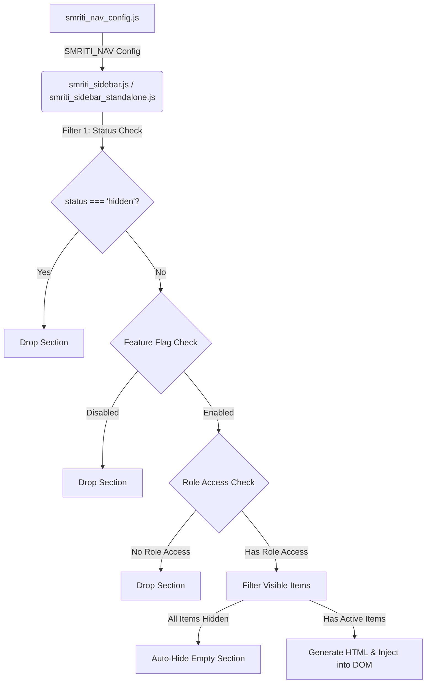

# SMRITI Retail OS — Navigation & Sidebar Audit Report

This report presents a comprehensive audit of the sidebar navigation system, tracing the rendering pipeline from configuration models to final DOM generation.

---

## 1. Sidebar Rendering Pipeline

The rendering lifecycle for the SMRITI sidebar proceeds as follows:

---

## 2. Dynamic Sidebar Audit Table

Below is the verification status for every section and item defined in the SMRITI Navigation configuration:

| Category / Menu Item | Exists in Config | Rendered | Hidden Reason | Fix Required |
| :--- | :---: | :---: | :--- | :--- |
| **Masters (Section)** | Yes | Yes | N/A | None |
| ├─ Product Catalog | Yes | Yes | N/A | None |
| ├─ Brand Master | Yes | Yes | N/A | None |
| ├─ Item Master | Yes | Yes | N/A | None |
| ├─ Category Master | Yes | Yes | N/A | None |
| ├─ Scheme Creator | Yes | Yes | N/A | None |
| ├─ CGE Studio | Yes | No | Configured `status: "hidden"` | None |
| ├─ Customers | Yes | Yes | N/A | None |
| ├─ Suppliers | Yes | Yes | N/A | None |
| ├─ Sizewise Item CRUD | Yes | Yes | N/A | None |
| **CGE (Section)** | Yes | Yes | N/A (Requires CGE roles for non-admin accounts) | None |
| ├─ Dashboard | Yes | Yes | N/A | None |
| ├─ Setup Headers | Yes | Yes | N/A | None |
| ├─ Benefit Instruments | Yes | Yes | N/A | None |
| ├─ Membership Tiers | Yes | Yes | N/A | None |
| ├─ Loyalty Programs | Yes | Yes | N/A | None |
| ├─ Campaigns | Yes | Yes | N/A | None |
| ├─ Promotion Rules | Yes | Yes | N/A | None |
| ├─ Coupon Rules | Yes | Yes | N/A | None |
| ├─ Loyalty Rules | Yes | Yes | N/A | None |
| ├─ Benefit Wallets | Yes | Yes | N/A | None |
| ├─ Customer Benefit Profiles | Yes | Yes | N/A | None |
| ├─ Resolution Policies | Yes | Yes | N/A | None |
| ├─ Liability Snapshots | Yes | Yes | N/A | None |
| ├─ Audit Logs | Yes | Yes | N/A | None |
| **PSV (Section)** | Yes | Yes | N/A (Requires PSV roles for non-admin accounts) | None |
| ├─ Distributor Accounts | Yes | Yes | N/A | None |
| ├─ Sales Uploads | Yes | Yes | N/A | None |
| ├─ Stock Uploads | Yes | Yes | N/A | None |
| ├─ Reconciliation | Yes | Yes | N/A | None |
| ├─ Dashboard | Yes | Yes | N/A | None |
| ├─ Stock Aging | Yes | Yes | N/A | None |
| ├─ Exception Analysis | Yes | Yes | N/A | None |
| ├─ PSV Opening Balance | Yes | Yes | N/A | None |
| **Sales (Section)** | Yes | Yes | N/A | None |
| ├─ POS Billing | Yes | Yes | N/A | None |
| ├─ Clienteling Studio | Yes | Yes | N/A | None |
| ├─ Sales Orders | Yes | Yes | N/A | None |
| ├─ Tax Invoice | Yes | Yes | N/A | None |
| ├─ Sizewise Invoice | Yes | Yes | N/A | None |
| ├─ Sales Return | Yes | Yes | N/A | None |
| ├─ Delivery Challan | Yes | Yes | N/A | None |
| ├─ Credit Notes | Yes | Yes | N/A | None |
| ├─ E-Way Bill Management | Yes | Yes | N/A | None |
| **Purchase (Section)** | Yes | Yes | N/A | None |
| ├─ Purchase Orders | Yes | Yes | N/A | None |
| ├─ GRN / Receipts | Yes | Yes | N/A | None |
| ├─ Purchase Invoice | Yes | Yes | N/A | None |
| ├─ Supplier Returns | Yes | Yes | N/A | None |
| **Inventory (Section)** | Yes | Yes | N/A | None |
| ├─ Warehouses | Yes | Yes | N/A | None |
| ├─ Opening Stock | Yes | Yes | N/A | None |
| ├─ Stock Operations | Yes | Yes | N/A | None |
| ├─ Stock Transfer | Yes | Yes | N/A | None |
| ├─ Stock Adjustments | Yes | Yes | N/A | None |
| ├─ Stock Audit | Yes | Yes | N/A | None |
| ├─ Barcode Center | Yes | Yes | N/A | None |
| ├─ Print Templates | Yes | Yes | N/A | None |
| **Finance (Section)** | Yes | Yes | N/A | None |
| ├─ Receipts | Yes | Yes | N/A | None |
| ├─ Payments | Yes | Yes | N/A | None |
| ├─ Advances | Yes | Yes | N/A | None |
| ├─ Integration Center | Yes | Yes | N/A | None |
| **Reports (Section)** | Yes | Yes | N/A | None |
| ├─ Sales Reports | Yes | Yes | N/A | None |
| ├─ Inventory Reports | Yes | Yes | N/A | None |
| ├─ Finance Reports | Yes | Yes | N/A | None |
| ├─ GST Reports | Yes | Yes | N/A | None |
| ├─ PSV Reports | Yes | Yes | N/A | None |
| ├─ Billing Metrics | Yes | Yes | N/A | None |
| ├─ Audit Reports | Yes | Yes | N/A | None |
| ├─ Analytics Dashboard | Yes | Yes | N/A | None |
| **Administration (Section)**| Yes | Yes | N/A | None |
| ├─ Day Open / Day Close | Yes | Yes | N/A | None |
| ├─ Shift / Register | Yes | Yes | N/A | None |
| ├─ User Management | Yes | Yes | N/A | None |
| ├─ Roles & Permissions | Yes | Yes | N/A | None |
| ├─ Config Portal | Yes | Yes | N/A | None |
| ├─ Security & Workflows | Yes | Yes | N/A | None |
| ├─ Audit Logs | Yes | Yes | N/A | None |
| ├─ License & Registration | Yes | Yes | N/A | None |
| ├─ Backup & Restore | Yes | Yes | N/A | None |
| ├─ Platform Center | Yes | Yes | N/A | None |
| ├─ POS Profiles | Yes | Yes | N/A | None |
| **Help Desk (Section)** | Yes | Yes | N/A | None |
| ├─ Knowledge Studio | Yes | Yes | N/A | None |
| ├─ Knowledge Center | Yes | Yes | N/A | None |
| ├─ Formula Registry | Yes | Yes | N/A | None |
| ├─ Business Dictionary | Yes | Yes | N/A | None |
| ├─ User Manual | Yes | Yes | N/A | None |
| ├─ Release Notes | Yes | Yes | N/A | None |
| ├─ Support | Yes | Yes | N/A | None |
| **AI Hub (Section)** | Yes | Yes | N/A | None |
| ├─ PDT Dashboard | Yes | Yes | N/A | None |
| ├─ Simulation Sandbox | Yes | Yes | N/A | None |
| ├─ Demand Forecasts | Yes | No | Configured `status: "hidden"` | None |
| ├─ Cashier Performance | Yes | No | Configured `status: "hidden"` | None |
| **Commercial (Section)** | Yes | Yes | N/A | None |
| ├─ Pricing Plans | Yes | Yes | N/A | None |
| ├─ ROI Calculator | Yes | Yes | N/A | None |
| ├─ Start Free Trial | Yes | Yes | N/A | None |
| ├─ Trial Leads CRM | Yes | Yes | N/A | None |

---

## 3. Key Findings

1. **JavaScript Validation:** No JS syntax exceptions are present in the configuration or sidebar renderers.
2. **Duplicate IDs:** None detected.
3. **Dropped Categories/Items:**
   - Items explicitly set to `status: "hidden"` (`cge_studio`, `demand_forecasts`, `cashier_performance`) are dropped at the filtering stage.
   - For non-manager/auditor roles, entire categories (`cge`, `psv`, `finance`, `administration`) are dropped at the role check gate.
4. **Expected vs. Rendered Count:**
   - Expected Active Sections: **12**
   - Rendered Sections (Full access context): **12**
   - Total Configured Menu Items: **93**
   - Active Menu Items: **89**
   - Hidden Menu Items: **4**
