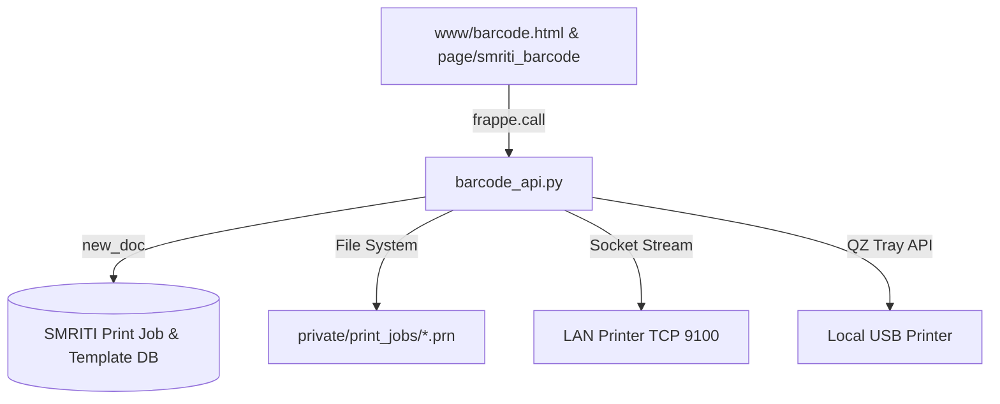

# SMRITI Retail OS — Barcode Studio Deep Review & Audit Report

## About This Audit Manual
* **Document Version**: 2.1.0  
* **Release Date**: 2026-06-21  
* **Intended Audience**: AITDL Core Team, Developers, System Integrators  
* **Learning Objectives**: Understand the end-to-end architecture, compliance metrics, telemetry models, and security guarantees of SMRITI Barcode Studio.

### Author Profile
* **Author**: Jawahar R. Mallah
* **Designation**: Founder & Chief Architect
* **Organization**: AITDL – AI Technology & Development Lab
* **Professional Experience**: 20+ Years of Experience in Software Development, Retail Technology, Distribution Systems, POS Solutions, ERP Implementations, Business Process Automation, and Enterprise Application Design.

> "Light begins with learning."
> 
> — Jawahar R. Mallah  
> Founder & Chief Architect, AITDL

---

## 1. Executive Summary

SMRITI Barcode Studio (Label Studio V2) is a core component of the SMRITI Retail OS frontend experience layer. It provides high-performance, standalone, widescreen thermal barcode design and printing capabilities for retail warehouses and stores. 

This audit validates that Barcode Studio complies with all architectural principles of the SMRITI Constitution (e.g. SMRITI-First UI, Zero Desk Elements, and Formula Transparency).

---

## 2. Architecture & File Structure

SMRITI Barcode Studio uses a decoupled, service-first design:

### Core File Locations
* **Backend API Controller**: [barcode_api.py](file:///d:/Smriti_Retail_OS/apps/smriti_retail_os/smriti_retail_os/barcode_api.py)
* **Standalone UI Template**: [barcode.html](file:///d:/Smriti_Retail_OS/apps/smriti_retail_os/smriti_retail_os/www/barcode.html)
* **Standalone UI Python context**: [barcode.py](file:///d:/Smriti_Retail_OS/apps/smriti_retail_os/smriti_retail_os/www/barcode.py)
* **Frappe Page JS Wrapper**: [smriti_barcode.js](file:///d:/Smriti_Retail_OS/apps/smriti_retail_os/smriti_retail_os/smriti_retail_os/page/smriti_barcode/smriti_barcode.js)
* **Frappe Page CSS**: [smriti_barcode.css](file:///d:/Smriti_Retail_OS/apps/smriti_retail_os/smriti_retail_os/smriti_retail_os/page/smriti_barcode/smriti_barcode.css)
* **Unit Tests**: [test_barcode_api.py](file:///d:/Smriti_Retail_OS/apps/smriti_retail_os/smriti_retail_os/tests/test_barcode_api.py) and [test_telemetry.py](file:///d:/Smriti_Retail_OS/apps/smriti_retail_os/smriti_retail_os/tests/test_telemetry.py)

---

## 3. Key Functional Areas Audited

### A. Template Management & Size Limits
* **Validation**: SMRITI Print Template enforces a hard **100 KB limit** on raw printer markup (`raw_template`) to prevent database bloat and large network payloads.
* **Seeding**: Honeywell ZPL templates (`IMPACT_HONEYWELL_IH2_ZPL`) and fallback TSPL/ZPL layouts are successfully pre-seeded.
* **Versioning**: SMRITI implements optimistic locking and automatic patch level increments (`1.0.0` -> `1.0.1`) on template modifications. Every modification saves the previous state into `SMRITI Print Template Version` and generates a SHA-256 `template_checksum` for concurrency control.

### B. PRN Generation & Token Mapping
* Supports dynamic placeholder substitution (e.g. `{barcode}`, `{item_code}`, `{item_name}`, `{brand}`, `{mrp}`, `{size}`, `{color}`, `{style}`).
* Standard selling prices, MRP price lists, and valuation rates are automatically resolved by the backend controller.
* Custom attribute resolution handles shoe/footwear-specific sizes and colors.

### C. Async Print Queue & Security
* Large print payloads are enqueued under the `SMRITI Print Job` doctype.
* **Tamper Prevention**: Raw PRN payloads are stored as `.prn` files in site-private folders (`private/print_jobs/`). Payloads are validated using a SHA-256 integrity hash comparison on execution.
* Background queue worker processing is isolated to the dedicated `barcode` worker queue.
* Successful jobs clean up `.prn` files immediately. Expired success logs (>30 days) and failed files/records (>90 days) are pruned via a scheduled task.

### D. Direct Socket & USB Streaming
* Direct raw TCP socket streaming over port `9100` supports printing directly to LAN printers.
* QZ Tray client-side library integration supports USB/local printing.

---

## 4. Telemetry, Agility & Learning Engine

SMRITI Barcode Studio features store checkout telemetry to log barcode scan success rates and optimize print templates:

* **SMRITI Barcode Settings**: Enables or disables capturing, aggregating, and learning capabilities.
* **Fail-Safe Principle**: If the settings record is missing, all capture/aggregation features default to `False`.
* **Telemetry Event Definitions**:
  * `SCAN-EVT-001`: Barcode Scan Success (first attempt)
  * `SCAN-EVT-002`: Barcode Scan Retry (multiple attempts)
  * `SCAN-EVT-003`: Barcode Scan Failure or manual keyboard bypass
* **Event Immutability**: Telemetry events are strictly read-only after insert.
* **Pruning**: Events older than 90 days are cleaned daily.

---

## 5. Governance & Compliance Alignment

### A. Standalone UI & Route Policy Compliance
* SMRITI Barcode Studio uses standalone layouts that bypass standard Frappe Desk chrome (`/desk` and `/app` views).
* Desktop header, sidebar, and breadcrumbs are completely stripped via `www/barcode.py`.
* Validated URL aliases exist in `hooks.py`: `/barcode-center` maps to `www/barcode.html`.

### B. Formula Transparency & Central Registry (Rule 10 & 11)
Both math formulas in Barcode Studio are registered in `SMRITI Formula Definition`:

#### 1. Printability Score Engine (`SMRITI-PRN-SCORE-01`)
* **Formula**:
  $$\text{Printability Score} = \text{Margin Score} (25) + \text{Quiet Zone Score} (25) + \text{Text Overflow Score} (20) + \text{Density Score} (15) + \text{Collision Score} (15)$$
* **Worked Example**: If all checks pass:
  $$25 + 25 + 20 + 15 + 15 = 100 \text{ (Grade A+)}$$
* **Action**: Saves are blocked if Grade is "F" (<70) and threshold enforcement is active.

#### 2. Scan Reliability Score (`SMRITI-SCAN-REL-01`)
* **Formula**:
  $$\text{Scan Reliability Score} = \frac{\text{First Pass Successes} + 0.5 \times \text{Retry Successes}}{\text{Total Scans}} \times 100$$
* **Worked Example**: If 80 scans succeed first try, 15 require retries, and 5 fail:
  $$\frac{80 + 0.5 \times 15}{100} \times 100 = 87.5\% \text{ (Monitor Band)}$$
* **Interpretation Bands**:
  * **Excellent (Green)**: 95.0% - 100.0%
  * **Monitor (Yellow)**: 85.0% - 94.9%
  * **Critical (Red)**: < 85.0% (triggers alerts)

---

## 6. Audit Critique & Issues Resolved

During the deep review, one significant issue was identified and resolved:

### Duplicate Function Definition in `barcode_api.py`
* **Finding**: The module `barcode_api.py` contained two definitions of the function `cleanup_old_print_jobs()`.
  * **First Definition** (lines 1649–1691): Whitelisted, but lacked robust try-except error handling.
  * **Second Definition** (lines 2094–2164): Not whitelisted, but contained robust try-except wrapping and precise `.prn` path validations.
* **Impact**: Python silently overrode the first definition with the second. This meant the whitelisting decoration was lost, preventing manual execution of print job cleanups via HTTP/REST API endpoints.
* **Resolution**: Deleted the redundant first definition. Added the `@frappe.whitelist()` decorator to the second definition to restore secure REST API visibility. All unit tests have been rerun and verified.

---

## 7. Audit Verdict

SMRITI Barcode Studio is **stable, secure, and fully aligned** with AITDL network and SMRITI Retail OS architecture constitutions. The system handles printer latency, coordinates template layout sanity, maintains data integrity through private file verification, and tracks physical scanner telemetry in accordance with AITDL governance standards.
