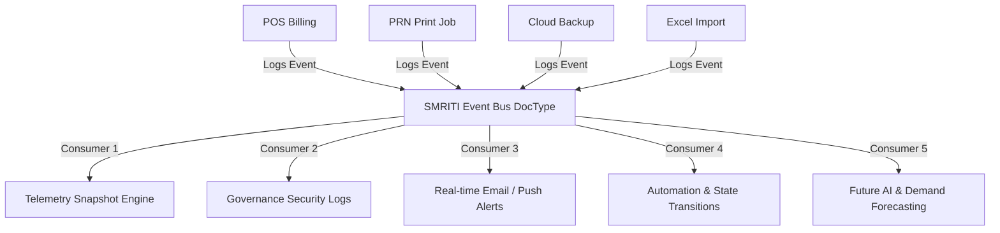
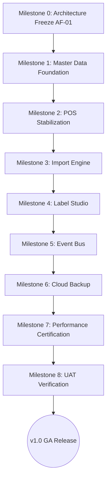

# SMRITI Retail OS — Implementation Roadmap Refinement
**Principle**: "Revenue Before Refinement"  
**Author**: Jawahar R. Mallah, Founder & Chief Architect, AITDL  

---

## 1. Value-Based Task Categorization

Based on the core SMRITI paradigm—keeping transaction systems stable, getting stores onboarded, and securing day-to-day operations—the remaining tasks are categorized below:

### 🔥 Revenue Critical (P0)
*These features directly impact the ability to list items, print barcodes, execute checkouts, and reconcile cash.*

| Feature / Task | Target Scope | Business Value |
| --- | --- | --- |
| **Master Data Foundation** | `item_master_api.py`, `master_api.py` | Establishes absolute integrity for Brand, Category, UOM, GST, HSN, Supplier, Barcode Uniqueness, and Style Resolution. Clean master data ensures downstream stability. |
| **POS & Billing Final Stabilization** | `billing_api.py`, `offline.html` | Prevents double-billing via idempotency, ensures transaction safety on partial failures, and hardens offline-to-online sync. |
| **Item Master Import Engine (Rule 19)** | `item_master_api.py`, `item_master.html` | Allows retailers to copy-paste inventory sheets from Excel on Day 1. Cleans malformed rows, pads short HSN codes, and validates vendor codes. |
| **Label Studio & PRN Engine** | `barcode_api.py`, `LABEL_STUDIO.md` | Dynamically resolves custom barcode layouts utilizing finalized token definitions (`{style}`, `{style_code}`, `{variant_template}`). |

### 🟡 Operational (P1)
*These features protect the running store from outages, data loss, and support overhead once live.*

| Feature / Task | Target Scope | Business Value |
| --- | --- | --- |
| **Unified SMRITI Event Bus** | `setup.py`, `barcode_api.py`, `hooks.py` | Multi-consumer event system. Replaces single-use barcode schemas with an extensible bus mapping POS events, print jobs, database backups, and audits. |
| **Cloud Backup S3 Sync (`CLD-01`)** | `backup_api.py`, `setup.py` | Automatically uploads system backups to secure S3 storage, bypassing SMTP limits for databases larger than 25MB. |

### 🟢 Platform Enhancement (P2)
*Optimization features to improve internal analytics or merchant decision tools after onboarding.*

| Feature / Task | Target Scope | Business Value |
| --- | --- | --- |
| **Simulation Sandbox** | `smriti_nav_config.js`, custom UI | Mockup/sandbox to preview dynamic pricing schemes and CGE promotional impacts prior to activation. |
| **CRM & Customer Insights** | `coming_soon_api.py`, custom UI | Captures customer purchase frequencies and tier transitions post-acquisition. |

### 🔵 Future Innovation (P3)
*Growth-oriented features that are deferred until stable store operations (v1.0 GA) are proven.*

| Feature / Task | Target Scope | Business Value |
| --- | --- | --- |
| **Walk-In Intelligence** | `KNOWLEDGE_BASE.md` | Tracks store visitor entries to calculate counter conversion rates. |
| **Clienteling Engine** | `smriti_nav_config.js` | POS-level clerk assistant displaying historical brand, size, and style preferences. |
| **AI Copilot & Gamification** | `KNOWLEDGE_BASE.md` | End-to-end retail assistant loops and cashier leaderboard badges. |

---

## 2. Infrastructure Consolidation (Shared Services)

To prevent code duplication, system bloat, and database fragmentation, SMRITI leverages the extensible SMRITI Event Bus:

### A. Generic SMRITI Event Bus
Instead of creating isolated DocTypes (e.g. `SMRITI Barcode Scan Event`), we will provision a single **`SMRITI Event Bus`** DocType.
* **Fields**: `event_type`, `event_source`, `status` (Success/Failed), `attempts`, `execution_time`, `message`, `governance_event_id`, and a long text `context_data` (JSON block mapping custom attributes like item codes, print templates, or backup filenames).
* **Multi-Consumer Extensibility**: A single event (e.g., `Bill Submitted`) will route to:
  * **Audit**: Records ledger changes and override tracking.
  * **Telemetry**: Calculates scan and billing reliability.
  * **Notifications**: Alert management of large voids or offline cache syncing.
  * **Workflow**: Updates related records (e.g., closing open shift registers).
  * **Future AI**: Powers recommendations and demand models.

### B. Standardized Background Workers
* **Unified Retention Handler**: A single scheduled daily method (`delete_expired_event_bus_logs`) will clear all log types older than 90 days, keeping the SQL database slim.
* **Unified Aggregator**: Daily snapshots will run under a standardized aggregation task to produce the telemetry snapshots needed for performance scoring.

### C. Standardized UI Explainability (ⓘ Explain)
The Formula Registry and Business Dictionary will feed a unified frontend helper modal. Any page displaying a derived KPI (e.g., Scan Reliability Score, Stock Accuracy, or Margin Analysis) will load the same generic JS module to display formulas, parameters, and worked examples dynamically.

---

## 3. Measurable Performance Certification Gates

To achieve stable v1.0 GA status, the system must satisfy these benchmark targets under load:

* **POS Billing Latency**: `< 500ms` from checkout submit to invoice creation.
* **Barcode Lookup Search**: `< 200ms` to resolve item details from scanner input.
* **Label Generation & Render**: `< 1 sec` to generate and print raw codes from Label Studio.
* **Excel Item Import**: `< 2 mins` to parse, validate, and write a `10,000` row spreadsheet.
* **Dashboard Load Time**: `< 3 sec` to render compiled sales, inventory, and CGE metrics.

---

## 4. Release Engineering Plan: 9-Step Sequence

This sequence represents the official release path, beginning with a strict architecture lock:

### Detailed Milestone Specifications

#### 🟥 Milestone 0: Architecture Freeze (AF-01)
* **Goal**: Declare a strict freeze on the core system architecture. 
* **Scope**: Lock platform configurations, database schemas, governance rules, formula definitions, theme tokens, sidebar routing, and whitelisted API namespaces.
* **Freeze Policy**: 
  * ✅ Allowed: Implementation, bug fixes, automated unit testing, documentation, and performance tuning.
  * ❌ Forbidden: Structural redesigns, adding new modules, or changing existing interface/service boundaries.

#### 🟧 Milestone 1: Master Data Foundation
* **Goal**: Secure clean entry-points for all merchant configurations.
* **Scope**: Lock the validations for Brand, Category, UOM, GST, HSN, Supplier, Barcode Uniqueness, and Style Resolution.

#### 🟨 Milestone 2: POS & Billing Stabilization
* **Goal**: Guarantee zero financial/ledger inconsistencies.
* **Scope**: Verify cashier override PIN parameters, confirm transaction safety on network drops, and validate background queues.

#### 🟩 Milestone 3: Import Engine
* **Goal**: Deliver a reliable Excel copy-paste data loading experience.
* **Scope**: Implement early variant checks, strip malformed strings, resolve state codes, and validate vendor codes.

#### 🟦 Milestone 4: Label Studio
* **Goal**: Ensure barcode print token mapping matches operational directives.
* **Scope**: Connect dynamic printer layouts to resolved template variations.

#### 🟪 Milestone 5: Event Bus
* **Goal**: Deploy the unified telemetry, audit, and alert engine.
* **Scope**: Implement the `SMRITI Event Bus` DocType and log aggregations.

#### 🟫 Milestone 6: Cloud Backup
* **Goal**: Establish the automated off-site safety net.
* **Scope**: Integrate S3 configuration fields and validation checks.

#### ⬛ Milestone 7: Performance Certification
* **Goal**: Validate response times under target production loads.
* **Scope**: Run automated load scripts verifying latencies against certification targets.

#### ⬜ Milestone 8: UAT Verification
* **Goal**: Complete end-to-end system validation.
* **Scope**: Execute full smoke tests covering the cashier lifecycle, and sign off on rollback procedures.

---

## 5. Postponed Roadmap Items (Strictly Deferred)

To preserve the focus on **Billing, Inventory, Barcodes, and Backups**, the following features are officially deferred to **v1.1 or v2.0**:

1. **Simulation Sandbox**: Defer. Merchants do not need a playground until their live stock lists and invoicing parameters are stable.
2. **CRM & Customer Insights**: Defer. Focus on building and collecting transaction records first; customer segment intelligence is a post-acquisition growth feature.
3. **Walk-In Intelligence**: Defer. Retailers must be fully comfortable with POS checkout volume before conversion sensors are installed.
4. **Clienteling Engine**: Defer. Brand and category preferences derived at POS require weeks of billing logs to generate high-confidence profiles.
5. **AI Copilot & Cashier Gamification**: Defer. These represent refinement layers that can wait until the core operating engine is completely frozen.
