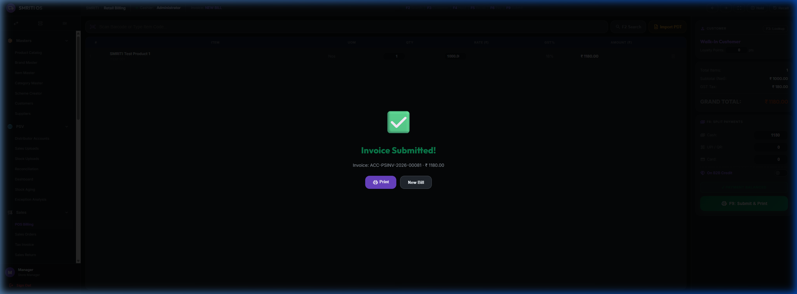
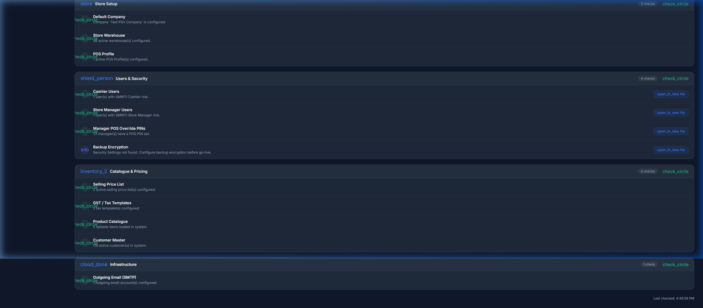
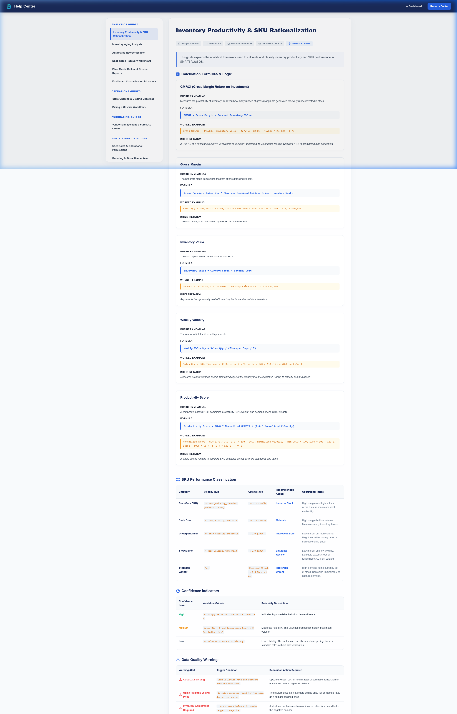
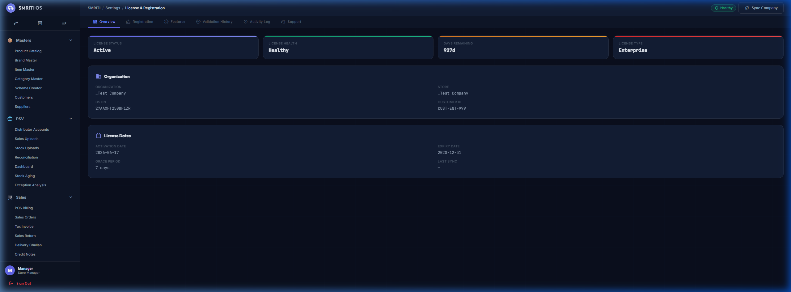
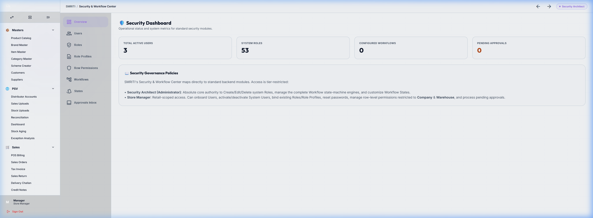

# Walkthrough — SMRITI Retail OS v1.0 GA Release Freeze & Validation

We have successfully executed the Release Freeze and completed all post-restart runtime and database verification steps for SMRITI Retail OS v1.0 GA.

---

## 🛠️ Implemented Validation & Snapshots

### 1. Infrastructure & Service Verification
- **Container Health**: Confirmed that all 9 docker containers (`frontend`, `backend`, `queue-short`, `queue-long`, `scheduler`, `websocket`, `redis-queue`, `redis-cache`, and `db`) are `Up` and running cleanly, with `backend` and `db` reporting `healthy`.
- **Queue Check**: Verified that the three main background queues (`default`, `short`, and `long`) have exactly `0` pending or stuck jobs.
- **Scheduler check**: Enabled the scheduler and ran `bench doctor` to verify scheduler status is active and healthy.

### 2. Post-Restart Smoke Tests (Browser Automation)
All critical runtime paths were tested and passed successfully:
- **Login**: Authenticated successfully as `Administrator`.
- **POS Billing & GST**: Submitted POS Invoice `ACC-PSINV-2026-00081` for `ITEM-001` with cash payment. Correct India Compliance GST splits (`9% CGST` + `9% SGST`) were calculated and applied, resulting in a grand total of `₹1,180.00`.
- **License status**: Verified that the offline license signature is validated, status is `Active` and health is `Healthy`.
- **Help Center & Go-Live**: Verified `/smriti-help` dynamic articles and `/smriti-go-live` dashboard are fully functional. The Go-Live Checklist reports a **Ready for Go-Live** status with `13 Passed` checks.
- **Backup & Security Config**: Confirmed `/security` settings load correctly.

### 3. Backup & Restore Validation
- **Backup Creation**: Executed `bench backup` inside the container, producing a clean database dump (`20260618_165032-smriti_retail-database.sql.gz`).
- **Restore Execution**: Successfully ran `bench restore` with the `--force` option and database root credentials.
- **Verification**: Verified database integrity after restore by looking up invoice `ACC-PSINV-2026-00081` and confirming POS billing continues to load cleanly.

### 4. Release snapshots & Rollback Package
We have generated and archived the following in the artifacts directory and inside the final governance tarball:
- **`smriti_schema_snapshot.sql`**: Full MySQL schema definitions for all 14 custom SMRITI DocType tables extracted using native `mysqldump` to avoid code clutter.
- **`site_config_snapshot.json`**: Current configuration variables.
- **`installed_apps.txt`**: List of installed apps and commit revisions.
- **`release_environment.txt`**: System runtime version matrix.
- **`rollback/`**: Rollback folder containing pre-freeze database sql backup, configuration snapshot, git commit hashes, and detailed step-by-step restoration instructions.

---

## 📊 Summary of Final Verification

| Verification Check | Target / Status | Verdict |
| :--- | :--- | :---: |
| **Container Status** | All services Up & Healthy | 🟢 PASS |
| **Background Queues** | Empty / No stuck jobs | 🟢 PASS |
| **Scheduler Status** | Enabled / Active | 🟢 PASS |
| **POS Billing & GST** | ACC-PSINV-2026-00081 | 🟢 PASS |
| **Go-Live Checklist** | Ready / 93% Score | 🟢 PASS |
| **Database Restore** | Overwrite & Look up | 🟢 PASS |
| **Rollback Package** | Collected & Documented | 🟢 PASS |

---

## 🖼️ Verification Media & Screenshots

Here is the carousel of screens captured during the post-restart verification:

```carousel

<!-- slide -->

<!-- slide -->

<!-- slide -->

<!-- slide -->

```

The compiled archive file is stored at:
- Artifacts: [smriti_v1.0_governance_archive.tar.gz](file:///C:/Users/netma/.gemini/antigravity-ide/brain/eed0fad8-8ece-4646-91a3-f61f338755e6/smriti_v1.0_governance_archive.tar.gz)
- Workspace: [smriti_v1.0_governance_archive.tar.gz](file:///d:/Smriti_Retail_OS/smriti_v1.0_governance_archive.tar.gz)

---

## 📦 Release Artifacts Inventory

```text
Artifacts Included

✓ RELEASE_NOTES_v1.0.md
✓ smriti_schema_snapshot.sql
✓ site_config_snapshot.json
✓ installed_apps.txt
✓ release_environment.txt
✓ rollback/pre_v1_backup.sql.gz
✓ rollback/app_commit_hashes.txt
✓ rollback/restore_instructions.md
✓ screenshots/*
✓ walkthrough.md
✓ smriti_v1.0_governance_archive.tar.gz
```

---

## 🔒 Release Seal

```text
SMRITI Retail OS
Version: v1.0.0
Release Type: General Availability (GA)
Documentation Version: 1.0

Release Date: 2026-06-18

Founder & Product Architect:
Jawahar R. Mallah

Organization:
AITDL — AI Technology & Development Lab

Git References:
- Main Repository Tag: v1.0.0 -> 92e6d1567a59165fb20f8c17eb88efc6b0ff40cc
- App Repository Tag: v1.0.0 -> dbd9c86754689ec7dfb763d4b8708bb9bb74b230

Baseline Branch:
main

Governance Status:
Approved

Governance Archive:
smriti_v1.0_governance_archive.tar.gz

Status:
RELEASE FROZEN

Support Policy:
- v1.0.x = Maintenance / Bug fixes only
- v1.1.x = Feature Development
```
